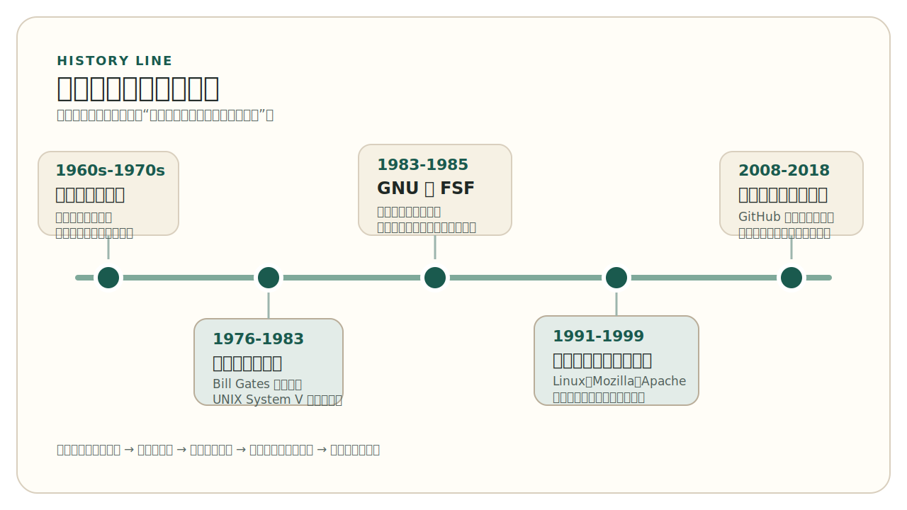

# 第 1 章 开源的起源与发展

*Origins and Evolution of Open Source*

2018 年 10 月 26 日，Microsoft 完成了对 GitHub 的收购。这个事件之所以具有象征性，不只是因为交易规模巨大，更因为它把开源历史中的一条深刻张力压缩在了同一幅画面里：一家曾长期站在商业软件一侧、甚至公开与 Linux 和自由软件阵营对立的公司，最终收购了全球最重要的开源协作平台之一。要理解这一幕为什么会发生，不能只从商业并购的角度解释，更要回到一个更早的问题：软件为什么会从共享走向封闭，又为什么重新走向开放协作？

这幅画面之所以值得反复回看，是因为它把几条看似分离的历史线索重新拉到了一起：软件商品化与商业竞争，程序员和研究机构对封闭化的反应，自由软件运动提出的控制权问题，以及平台化之后全球协作方式的变化。如果不回到这些更早的历史层次，人们很容易把 Microsoft 与 GitHub 的结合理解成单纯的企业策略调整，而看不到更根本的事实：开源已经从边缘性的技术立场，变成了现代软件世界的基础设施之一。

因此，本章要回答的不是“开源有什么好处”这样单一的问题，而是更基础的几个问题：在“open source”这个词出现之前，软件世界经历了怎样的变化？GNU 与自由软件运动到底提出了什么？Linux、Mozilla、Apache 这些项目为什么具有历史象征意义？为什么今天必须把开源理解为一种由制度、社区和工程共同支撑的软件生产方式？本章不是编年史，也不是著名项目小传，它要建立的是一条解释现代开源世界的起点主线。

## 1. 从共享到封闭：软件为什么会成为一个历史问题

在计算机发展的早期阶段，软件并不是今天意义上的独立产品。人们购买的是整台计算机，软件通常和硬件一起提供，服务于特定机器和特定机构。那个时代的软件高度依附硬件，程序往往需要不断修改、移植和调试，因此研究机构、大学实验室和厂商之间共享源代码并不罕见。对很多研究人员来说，源代码更像是一种必须被理解和调整的技术材料，而不是必须被严格封存的商业资产。

这也意味着，早期的软件共享首先是一种技术现实，而不是后来意义上的开放运动。程序常常随着机器一起交付，用户得到的不只是一个二进制结果，而是整套能够被阅读、调试和改造的技术对象。厂商工程师、大学研究者和实验室使用者之间之所以会交换程序、修补程序、传播源码，很大程度上是因为软件只有被看懂、被改动，才能继续在新的机器、任务和环境里工作。换句话说，开放在当时并不是一个被明确命名的制度原则，而是由技术条件和科研协作方式共同推动出来的实践状态。

这种共享并不等于现代意义上的开源。它更多是一种由技术条件、科研环境和产业结构共同决定的实践方式。软件之所以能够被共享，不只是因为人们观念开放，也因为那时的软件复杂度、商业模式和法律环境，与今天完全不同。正因如此，理解开源的起点，不能把早期软件共享浪漫化为已经成熟的开源生态；它只是后来的历史土壤。

到了 20 世纪 70 年代以后，情况开始发生变化。随着操作系统、编译器和工具链越来越复杂，软件开发成本快速上升，软件逐步从硬件附属品变成具有独立价值的商品。软件商品化并不是错误，相反，它推动了产业分工、产品化和专业化。但它也改变了软件的边界：谁有权复制，谁有权修改，谁能继续传播，谁能理解一个系统如何工作，这些问题都不再是理所当然的。

这里最关键的变化，并不只是“软件开始收费”。收费本身只是市场机制的一部分，许多软件服务和产品当然可以合法地定价。真正构成历史转折的，是软件逐步被作为受严格控制的商品来管理之后，使用者与开发者对软件内部结构的接近权开始发生改变。程序是否能够被研究，是否允许被修改，修改后是否可以重新分发，越来越不再由技术需要决定，而更多由授权边界决定。正是在这一层上，软件才开始成为一个超出单纯产品交易的问题。

个人计算早期的一个象征性事件，也把这种变化公开化了。1976 年，Bill Gates 在《An Open Letter to Hobbyists》中公开抱怨 Altair BASIC 被广泛复制却很少付费，并尖锐追问：`Who can afford to do professional work for nothing?` 这封信的重要性，不在于它给出了后来所有争论的正确答案，而在于它清楚地显示出一个新现实：软件正在被越来越明确地视为可以单独销售、需要通过复制控制来回收开发成本的产品。到了这一步，“复制软件是否还像复制研究材料那样自然”已经不再只是技术习惯问题，而开始变成制度与商业边界问题。

UNIX 的历史非常能说明这种变化。它早期在学术机构和研究环境中广泛传播，对后来的计算机教育和系统开发影响极大；但随着商业价值上升，授权政策也发生了变化。到 1983 年 AT&T 推出 UNIX System V、商业授权路径进一步清晰时，这种变化已经不再只是氛围上的收紧，而是更明确地体现在制度边界上。对于一部分程序员和研究者来说，问题并不只是软件开始收费，而是软件开始被越来越强地控制。收费意味着市场机制，控制则意味着使用者对软件的理解、修改和再传播能力受到限制。正是在这种历史张力中，后来的自由软件运动才不只是一个“技术选择”，而是一种对软件封闭化趋势的回应。

也正因为如此，后来的争论从一开始就不是“要不要产业化”这么简单。许多程序员并不反对软件成为专业产业，也不反对开发者通过软件获得报酬；真正引发反应的是，软件一旦被视为黑箱式商品，使用者对计算环境的理解能力、共同改进能力和长期控制能力就会随之下降。对那些把软件视为知识、工具和基础设施的人来说，这种变化不只是市场变化，更是技术生活方式的改变。

这里有一个重要判断：开源不是因为“共享很美好”才出现的，而是因为软件一旦成为基础性的知识和基础设施，人们就会不断追问，软件究竟应该被如何拥有、如何传播、如何共同改进。开源问题从一开始就是技术问题、制度问题和社会问题交织在一起的。

## 2. GNU 与自由软件运动：问题被正式提了出来

如果说软件商品化让矛盾逐渐显现，那么 GNU 项目与自由软件运动则是第一次把这些问题明确地提了出来。1983 年 9 月，Richard Stallman 发布 GNU 项目的初始公告；1984 年 1 月，GNU 项目真正开始启动。GNU 的目标并不只是写几个自由软件工具，而是尝试构建一个自由的 Unix-like 操作系统环境。这个目标的重要性在于，它把“软件自由”从零散的不满，提升为一个清晰、持续、可组织化推进的工程与思想计划。

这一时间线需要被看得更清楚一些。1983 年的公告意味着问题被正式公开提出，1984 年项目真正启动，意味着这不再只是抗议或宣言，而变成了持续的技术建设。GNU 从一开始就不是一个零散工具集合，而是一个完整系统计划：它试图回答的不是“能不能共享几个程序”，而是“能不能在一个自由的系统环境中重新组织软件生产”。正因为目标是一整套 Unix-like 环境，GNU 才具有超出单个软件项目的历史意义。

1985 年，Stallman 发布了较完整版本的《GNU Manifesto》，同年 10 月，自由软件基金会 Free Software Foundation（FSF）成立。到这一步，问题已经不仅是“有没有人愿意共享代码”，而是“软件的使用者是否应该拥有运行、研究、修改和再分发软件的自由”。自由软件运动的核心并不在于价格，而在于控制权。这里的“free”首先是 freedom，而不是 free of charge。

这也是为什么 GNU 与 FSF 的出现，不能只被理解为某位程序员的个人理想主义表达。它们真正改变的是问题的表达方式：软件不再只是厂商提供给用户的成品，而是与使用者的理解能力、修改能力和共同改进能力直接相关的社会技术对象。只要软件越来越深入教育、科研、基础设施和公共计算环境，那么谁能控制它、谁能改进它、谁能决定它的传播方式，就不再只是商业决策，而会变成制度问题和公共问题。

这一点对理解开源历史非常关键。今天很多人会把自由软件和开源软件混为一谈，仿佛它们从一开始就是同一个概念。历史上并不是这样。GNU 与 FSF 代表的是自由软件运动，它强调软件自由背后的伦理和制度问题；而“open source”作为术语，以及围绕这一术语形成的组织化推动，则是 1998 年才出现的事情。两者有深刻连续性，但并不完全相同。

这种区分之所以重要，不只是为了术语准确，更因为它直接影响我们如何理解后来的开源扩张。自由软件运动首先把问题讲清楚：软件自由意味着使用者不应被完全排除在理解、修改和再传播之外。后来的开源运动则在这一历史基础上，进一步发展出更容易被产业界、媒体和更广泛开发者群体接受的表达框架。两者并不是相互取消的关系，而更像是同一历史主线中的两个不同阶段：前者把问题尖锐地提出，后者让这一问题以新的语言进入更广泛的软件世界。

GNU 项目之所以重要，还有一个原因：它试图证明，反对软件封闭化并不只能停留在宣言层面，而可以落实为实际的技术建设。编译器、编辑器、调试器、工具链，这些基础组件的积累，使自由软件运动不是抽象的口号，而是具体的软件生产实践。也正因为如此，GNU 的影响后来远远超出了它最初设想的范围。

很多人后来真正接触 GNU 的方式，也并不是先读宣言，而是先接触这些工具。换句话说，GNU 的力量不只在于思想文本，还在于它把思想要求翻译成了真实可用的工程积累。对历史来说，这一点非常关键：一个理念只有进入工具、进入系统、进入开发者的日常工作流，才可能持续地产生影响。

在这条历史线上，GNU GPL 的出现具有制度象征意义。它并不是第一章要详细展开的主题，但必须在这里点到：自由软件运动不是单靠道德呼吁维持的，它逐步形成了自己的法律与制度表达。后面第 2 章讨论许可证时，我们会看到，开源世界之所以能够长期运转，很大程度上正是因为这些制度基础被明确写了下来。

因此，GNU 与自由软件运动留给后来的开源世界的，不只是几款著名软件，也不只是几句带有争议的口号，而是一整套更重要的遗产：问题意识、系统建设能力，以及把理念转化为制度表达的尝试。它们把问题提了出来，但要让这些问题真正进入大规模软件现实，还需要后来的代表性项目把理念进一步变成可用系统、公共传播和稳定组织。

> Warning
> 在叙述中，应避免把“GNU 的诞生”直接写成“开源运动的开始”。更准确的说法是：GNU 与 FSF 启动了自由软件运动，而后来的开源运动是在这一历史基础上形成的。

## 3. 从理念到生态：Linux、Mozilla 与 Apache 如何改变了开源

如果 GNU 和自由软件运动提出了问题，那么 Linux、Mozilla 和 Apache 则说明，这些问题并没有停留在理念层面，而是在不同方向上推动开源走向可用系统、公共传播和稳定组织。

先看 Linux。严格来说，Linux 首先是一个内核项目，而不是一个完整操作系统。到 1990 年前后，GNU 已经完成了大部分关键系统组件，但仍缺少一个真正可用的内核；1991 年，Linus Torvalds 开始开发 Linux 内核；1992 年，Linux 成为自由软件。正是 GNU 提供的大量系统组件与 Linux 内核结合，才使一个真正可用的自由操作系统环境逐步成形。像 Slackware、Debian 这样的早期发行版，做的正是把内核、shell、编译器、工具链和安装体系组织成可实际部署的系统。正因如此，Linux 的历史意义不只是“有人写出了一个内核”，而是它补上了自由软件系统长期缺失的关键一块，让这一系统第一次获得了大规模可用性。围绕软件自由与开放协作的实践，从此不再只是价值立场，也成为可以支撑真实计算环境的基础设施。

  
历史片段 Historical Story

  
1991 年 8 月 25 日，21 岁的赫尔辛基大学学生 Linus Torvalds 在 <code>comp.os.minix</code> 新闻组发帖，告诉其他人自己正在为 386(486) AT 机器写一个免费的操作系统，并把它描述成一个出于个人兴趣的项目，还特别补了一句：它不会像 GNU 那样“大而专业”。今天回看，这段自我介绍带有鲜明的历史反差。一个在公共讨论空间中以谦逊口吻发布的个人项目，后来成为全球服务器、云计算、移动设备和嵌入式系统的重要基础。

  
这段帖子真正重要的地方，不是“某位天才一夜之间改变世界”的传奇感，而是它清楚地显示出开源形成时的一种典型机制：个人因真实技术需求发起项目，在公共空间里说明目标、邀请反馈、吸引协作，并接到前一阶段已经存在的 GNU 工具与自由软件传统上。Linux 的历史意义，正是在这种接力关系中才真正显现出来。

这层意义不能被低估。理念要真正进入现实，必须通过可以运行、可以部署、可以维护的系统表现出来。Linux 的出现说明，自由软件传统并不只能停留在批判软件封闭化的层面，它也能够产出足够强大的技术成果，进入服务器、开发环境、网络基础设施和更广泛的软件生态。到这里，开放协作已经不只是伦理主张，而开始成为工程能力的证明。

再看 Mozilla。1998 年，Netscape 宣布开放浏览器源码，Mozilla 项目随之形成。这件事之所以重要，不只是因为一个著名浏览器开放了源码，而是因为它使开放源码进入更广泛的公共视野。此前，自由软件运动在很大程度上仍带有程序员社群和技术理想主义色彩；而 Netscape / Mozilla 事件让更多企业、媒体和开发者开始意识到，开放源码不只是小圈子的实践，而可能是一种新的软件生产和生态组织方式。

Mozilla 的意义因此不应被缩减为浏览器历史的一段插曲。它更像是一个传播窗口：开放源码第一次以大型商业软件事件的形式进入主流讨论空间。对媒体来说，这意味着开源不再只是程序员内部议题；对企业来说，这意味着开放源码可能是一种现实可用的战略选择；对开发者来说，这意味着开放协作开始拥有比自由软件运动早期更广泛的公共可见性。后来 “open source” 术语能在 1998 年迅速扩散，很大程度上也与这一传播窗口被打开有关。

Apache 则代表了第三种意义。Apache 起初是围绕 HTTP 服务器的一组补丁协作，很快发展为高度成功的开源项目；1999 年，Apache Software Foundation 正式成立。后来长期流传的一种解释，甚至直接把 Apache 说成对 `a patchy server` 的双关。无论是否把这类说法当成正式命名史，它都准确传达了 Apache 早期形态的核心特征：项目不是从完整组织起步，而是从公开补丁协作逐步长成稳定社区。这个案例表明，开源不仅可以产出代码，还会进一步发展出社区协作机制、组织形式和长期治理结构。换句话说，开源不只是“有人愿意公开源码”，而是逐步学会了如何把分布式协作、项目维护和制度支持组织起来。

Apache 的重要性还在于，它让人们看到开源项目并不一定只能围绕某位核心作者或少数技术领袖维持。一个项目可以从补丁协作出发，逐步沉淀出稳定的公共协作规则、责任结构和制度支撑，并最终发展成基金会化的长期组织。这条路径后来对许多项目都具有示范意义：开源不只是个人英雄写出伟大代码，也可以是社区通过规则和组织积累出可持续的公共工程。

把这些案例放在一起看，就能更清楚地看到一条分工明确的历史链条：GNU 代表问题意识和自由诉求，Linux 代表可用系统的形成，Mozilla 代表开放源码进入主流传播空间，Apache 代表社区化与制度化的深化。它们共同说明，开源之所以能持续扩大影响，不是因为某一位英雄人物完成了全部工作，而是因为不同项目、不同组织和不同历史节点承担了不同角色。

下面这张对照表，把这几个关键节点在历史链条中的不同作用压缩成一个更容易回看的框架。

<!-- figure-id: ch01-tab-01-project-role-map | core | status: final | source-trail: chapter 1 §3 narrative; legacy course case comparison; fully rewritten -->

表 1-1 GNU、Linux、Mozilla 与 Apache 在开源形成中的不同角色

| 项目 / 组织 | 关键节点 | 在开源形成中的主要作用 |
| --- | --- | --- |
| GNU / FSF | `1983` GNU 启动，`1985` FSF 成立 | 把软件自由正式写成系统建设目标与制度表达 |
| Linux | `1991` Linux 内核启动，`1992` 成为自由软件 | 补上自由软件系统长期缺失的可用内核，使理念进入可部署系统 |
| Mozilla | `1998` Netscape 开放源码 | 让开放源码进入更广泛的公共传播空间和企业视野 |
| Apache | 从补丁协作发展为稳定项目，`1999` ASF 成立 | 说明开源可以从分布式协作走向制度化社区与长期治理 |

从这里开始，“开源”已经不再适合被理解成单个项目的属性。它开始表现出更像生态系统的特征：有项目，有维护者，有贡献者，有组织，有制度，有传播平台，也有企业和公共机构的参与。后面章节中要讲的治理、协作流程和工程机制，其实都已经在这条历史线上悄悄出现了。

## 4. 从 1998 到今天：为什么必须重新理解“开源”

1998 年是一个关键年份，但它的重要性不应被简单理解为“从这一年开始，开源才诞生”。更准确的说法是：这一年，自由软件运动积累下来的问题意识，与新的传播策略、企业开放源码事件和组织化推动叠加在一起，使“open source”成为一个能够迅速扩散的新框架。

如果把视野再收紧一些，还会发现 1998 年的重要性来自几件事的叠加，而不是单一事件。1997 年，《大教堂与集市》已经为开放式开发模式提供了极具传播力的叙事总结；1998 年初，Netscape 开放浏览器源码，为开放源码进入主流公共视野打开了新的窗口；随后，“open source” 这一术语被提出，OSI 开始形成组织化推动。正是在这种“理念积累 + 企业事件 + 新术语 + 组织化”的叠加下，开源才从一个较窄社群中的历史传统，迅速变成更容易扩散的公共框架。

根据 OSI 的官方历史，“open source”这一术语在 1998 年 2 月初的一次策略会议上被确定下来，Christine Peterson 提出了这个词，随后 Eric Raymond 和 Bruce Perens 共同推动了 Open Source Initiative（OSI）的成立。OSI 的意义在于，它把此前分散的实践与讨论，组织成一个更容易被产业界、媒体和更广泛技术群体接受的表达框架。这个变化并没有抹去自由软件运动的历史，相反，它建立在前一阶段的积累之上，只是强调的重心有所不同。

之所以会出现这种表达变化，并不是因为自由软件传统突然失效，而是因为不同表述会带来不同的传播效果。相较于更强调伦理与自由诉求的 “free software”，`open source` 更容易被理解为一种开发方式、一种协作模式和一种可与商业共存的组织方法。它弱化了公众在词义上的误解空间，也使更多企业和媒体愿意进入讨论。历史上真正发生的，不是旧问题被放弃，而是旧问题获得了新的语言入口。

从 1998 年往后看，开源世界的扩张呈现出三个长期趋势。

第一，基金会化。越来越多的重要项目不再只依靠个人魅力或少数开发者维持，而是通过基金会、项目委员会、治理流程和社区规则来获得持续性。基金会并不是开源的全部，但它们提供了托管知识产权、协调治理、组织活动和稳定生态的重要能力。

基金会化的重要性在于，它让项目逐步超越“某几个人在维护”的状态。一个项目一旦被更多组织和开发者依赖，它就需要更稳定的权责边界、更可持续的治理载体和更长期的公共合法性。基金会既不是开源的起点，也不是开源成熟度的唯一标志，但它确实提供了一种重要机制：让项目在个人离开、企业策略变化或社区规模扩大时，仍然能够维持公共协作的连续性。

第二，平台化。到 21 世纪，代码托管平台逐步成为开源协作的关键基础设施。GitHub 在 2008 年上线之后，把仓库、议题、Pull Request、代码评审、发布和社区可见性放在了同一平台里，大幅降低了全球协作的门槛。开源项目并不等于 GitHub 项目，但 GitHub 确实改变了许多人理解和参与开源的方式。也正因为如此，Microsoft 收购 GitHub 才具有强烈的历史意味：这不是一个普通平台并购，而是开源已经从边缘文化走向现代软件基础设施的象征。

平台化改变的不只是代码放在哪里，而是协作如何被组织、如何被看见、如何被记录。仓库、Issue、Pull Request、Review、Release 和公共讨论被放到同一平台之后，参与开源的入口被显著压低，项目的公共痕迹也变得更集中、更可追踪。对后来的开发者而言，开源不再首先表现为邮件列表、源代码压缩包或分散的网站入口，而更常表现为一个有清晰仓库地址、有公共工作项、有审查记录的协作空间。现代人对开源的直观印象，在很大程度上就是被这种平台化重新塑造的。

第三，产业化。今天，大量企业依赖开源、参与开源、维护开源，甚至围绕开源建立商业模式。这里需要再次强调：开源不是反商业。历史真正表明的是，开源与商业之间始终存在张力，但也始终在相互塑造。企业可能借助开源建立生态、扩大标准影响力、吸引开发者，也可能通过基金会、赞助、维护和代码贡献反向塑造开源世界。理解这一点，有助于我们避免把开源讲成一种简单的道德神话。

这也解释了为什么今天讨论开源时，既不能把企业参与简单视为污染，也不能把它浪漫化为天然善意。企业进入开源，带来了资金、工程能力、平台资源和大规模采用机会；与此同时，它也可能带来控制权集中、规则重心偏移和生态依赖等新的问题。现代开源世界真正成熟的地方，不在于消除了这种张力，而在于逐步发展出制度、治理和工程机制，去管理这种张力，而不是假装它不存在。

如果把本章前面的历史主线再压缩一次，可以得到下面这条时间线。

<!-- figure-id: ch01-fig-01-open-source-timeline | core | status: final | source-trail: chapter 1 overall narrative; fully redrawn -->
<figure class="book-figure">
  
  <figcaption>图 1-1 开源历史主线时间线</figcaption>
</figure>

到了今天，如果还把开源理解成“把代码公开出来”，就已经远远不够了。现代开源至少同时包含四个层面。它是一种技术实践，涉及代码共享、复用与协作开发；它是一种制度安排，涉及许可证、版权和贡献规则；它是一种组织形式，涉及社区、治理和角色分工；它也是一种工程系统，涉及版本控制、评审、测试、持续集成、发布与长期维护。后面整本书所要讲的内容，都是这四个层面的展开。

换句话说，开源之所以重要，不是因为它让代码变得“看得见”，而是因为它改变了软件被创造、传播、维护和共同拥有的方式。只有把这一历史脉络看清楚，后面关于许可证、治理、协作流程和项目实践的讨论才不会变成孤立的工具说明。

这也是为什么本章必须在这里收束，而不能继续沿着时间线无限延长。到了这一点，真正重要的问题已经不再是“后来又出现了多少著名项目”，而是：如果开源已经成为一种稳定的软件生产方式，那么它凭什么长期运转？它的制度基础是什么？它的社区和治理如何维持？它的工程流程为何必须公开、可追溯、可协作？后面的章节正是沿着这三条线继续展开。

## 本章小结

开源并不是互联网时代突然流行的一种技术习惯，而是在软件商品化、封闭化和全球协作需求不断增强的背景下，逐步发展出来的一套历史性回应。GNU 与自由软件运动提出了问题，Linux 让自由软件系统走向可用，Mozilla 让开放源码进入更广泛的公共视野，Apache 说明开源可以发展出稳定的社区和组织结构，而 1998 年之后的术语转变、基金会化、平台化和产业化，则共同塑造了我们今天所处的开源生态。

理解这段历史，并不是为了背诵几个年份和人物名字，而是为了建立一个基本判断：开源不是单纯的共享代码，它是一种由理念、制度、社区与工程实践共同支撑的软件生产方式。接下来，第 2 章将转向这一体系的制度基础，讨论自由软件、开源软件与许可证之间的关系。

## 延伸阅读

- GNU Project, “The GNU Manifesto”
- GNU Project, “GNU Initial Announcement”
- GNU Project, “GNU History”
- Free Software Foundation, “A History of Free Software Foundation”
- Linux Kernel, “About Linux Kernel”
- Open Source Initiative, “History of the Open Source Initiative”
- Eric S. Raymond, *The Cathedral and the Bazaar*
- Apache Software Foundation, “Apache History”
- Mozilla, “Mozilla History”
