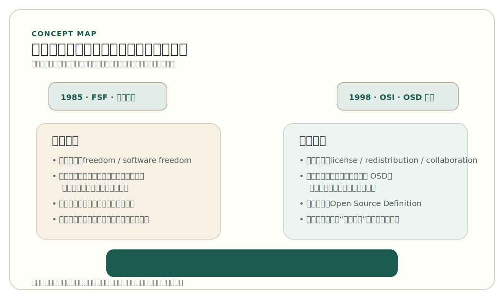

# 第 2 章 自由软件、开源软件与许可证

*Free Software, Open Source, and Licensing*

一个项目团队把代码放到了 GitHub 上，仓库设成了公开，README 也写得很认真，大家自然觉得“这已经是开源项目了”。几周后，另一支队伍希望复用其中一部分代码，却发现仓库里没有 `LICENSE` 文件。代码明明看得见，为什么却不能理直气壮地拿来修改、再发布，甚至继续公开协作？这个问题看起来细小，实际上碰到了开源世界最基础、也最容易被忽略的一层结构：开源并不只是把源代码公开出来，更是通过许可证把使用、修改、分发和再发布的边界明确写下来。

第一章讨论了开源如何从一段历史问题逐步发展为现代软件世界的基础设施。本章则要进一步回答：自由软件（Free Software）与开源软件（Open Source Software）到底是什么关系？为什么“代码可见”并不自动等于“这是开源软件”？为什么许可证（License）不是仓库里的装饰文件，而是开源协作的制度基础？这些问题看似抽象，实际上会直接影响读者能否正确阅读别人的仓库、能否合规复用代码、能否为自己的项目做出清晰的发布选择。

本章不提供法律意见，也不试图把读者训练成许可证专家。它更重要的目标，是建立一种稳定的工程判断：开源不是没有规则，而是把规则公开、提前、明确地写出来。理解了这一点，后面关于社区治理、协作流程和项目发布的讨论才会有真正的抓手。

本章的叙述顺序也因此很明确。首先要厘清自由软件与开源软件的关系，避免把历史传统、制度表达和工程协作混成一个模糊标签；然后要说明许可证为什么是开源世界真正的制度入口；接着再用少量但稳定的框架区分常见许可证；最后再把这些讨论落回真实项目，说明许可证选择为什么是项目设计的一部分，而不是发布前随手补上的一个文件。

## 1. 自由软件与开源软件，到底是什么关系

在日常讨论里，“自由软件”和“开源软件”经常被并列使用，很多人甚至直接把它们当作同义词。这种用法在宽泛语境下并不罕见，但如果完全不区分两者，就很容易把开源历史里最关键的张力抹掉。

自由软件首先是一个关于 software freedom 的概念。按照 GNU / Free Software Foundation 的经典表述，自由软件强调使用者应当拥有四项基本自由：运行程序的自由，研究程序并按自己的需要修改它的自由，再分发副本的自由，以及分发修改版本的自由。这里的 `free` 首先是 freedom，而不是免费。一个自由软件项目可以收费发行，也可以围绕服务、支持、培训、托管和定制开发形成商业模式。把自由软件理解成“免费软件”，或者理解成“反商业软件”，都属于典型误解。

FSF 对这一点的表述其实非常清楚：获取源代码是研究和修改程序的前提，而商业使用、商业开发和商业分发并不会自动破坏软件自由。也就是说，自由软件并不是站在“商业”对立面去定义自己的，它真正关心的是使用者是否拥有足够的控制权，能否理解和改造自己所依赖的软件。只要这四项自由得到保障，自由软件完全可以进入市场、进入公司、进入专业服务体系，甚至正因为它可以进入这些场景，软件自由才不会停留在小圈子理想中。

开源软件则更强调另一层表达。按照 Open Source Initiative（OSI）的定义，开源不是“源码可以看到”这么简单，而是软件的分发条件必须符合 Open Source Definition（OSD）。也就是说，开源首先是一种基于许可证的制度安排。它要求源代码可获得，也要求再分发、衍生作品等关键权利得到明确许可。仅仅把代码放在公开仓库里，并不能自动满足这些条件。

如果进一步看 OSD 的关键条款，会更清楚地发现这一点。开源不仅要求源代码可获得，还要求自由再分发（Free Redistribution）、允许衍生作品（Derived Works），并且不能对使用者身份或使用领域进行歧视。一个许可证如果禁止商用，或者只允许学术用途，哪怕它把源码完整公开出来，也不符合标准意义上的 open source。正是在这个意义上，“能看到代码”和“这是开源软件”之间，隔着一层明确的制度边界。

这种差异也有明确的组织史坐标。1985 年成立的 Free Software Foundation 用“四项自由”来界定软件自由；1998 年成立的 Open Source Initiative 则用 Open Source Definition 来界定何种分发条件足以构成开源。前者更像是在确认使用者应当拥有哪些基本控制权，后者更像是在确认什么样的许可边界足以支撑开放协作与广泛再分发。

因此，自由软件与开源软件并不是彼此无关的两个世界。它们有共同的历史土壤，也都反对那种把软件完全封闭为不可理解、不可修改、不可再传播对象的做法；不同之处在于表达重心并不完全相同。自由软件更直接地强调使用者的自由与控制权问题，开源软件则更强调开放协作、可复用性以及这种实践如何被更广泛的工程群体和产业界接受。

这一差异为什么重要？因为它提醒我们，开源并不是一个纯技术词汇，它同时带有历史、制度和价值背景。如果只把开源理解为一种“更高效的开发方法”，就会忽视它与自由软件传统的连续性；但如果把现代开源世界完全还原为自由软件运动的同义词，也会忽视 1998 年以后围绕开放协作、产业传播和制度可接受性形成的新框架。更稳妥的判断是：自由软件与开源软件有深刻连续性，但不应在概念上被压平成一个词。

如果把这种连续性与差异先压缩成一张关系图，大致会呈现下面这种结构。

<!-- figure-id: ch02-fig-01-free-software-and-open-source | core | status: final | source-trail: chapter 2 §1 narrative; fully redrawn -->
<figure class="book-figure">
  
  <figcaption>图 2-1 自由软件与开源软件：连续性与表达重心</figcaption>
</figure>

对今天的读者而言，真正有用的不是在词语上选边站，而是知道自己在阅读项目、解释许可证或启动仓库时，到底在处理哪一层问题。是在谈软件自由的历史与理念背景，还是在谈一个项目是否满足开源定义、能否被他人合法复用、能否进入更大范围的协作链条？一旦这一层分清楚，后面的许可证讨论就不再是名词辨析，而会变成对制度边界的具体理解。

> Note
> 在阅读项目资料时，如果仓库只说自己“公开了源码”，却没有说明许可证，也没有明确采用何种开源定义，不应急于把它判定为标准意义上的开源项目。

## 2. 为什么许可证是开源开发的制度基础

很多初学者第一次接触许可证时，都会把它看成一个附属文件：项目成熟了再补一个 `LICENSE`，似乎也没有太大问题。实际上，许可证之所以重要，恰恰是因为开源协作经常发生在彼此并不相识的人之间。陌生人要共同使用、修改、分发和再发布同一份代码，如果没有事先写明边界，协作就很容易停留在“好像可以”“大概没问题”的模糊状态里。

这里首先要澄清一个常见误解：开源不是没有版权，恰恰相反，开源依赖版权来进行制度安排。软件作者天然拥有版权，许可证的作用不是消灭版权，而是通过版权授予他人一组明确的权利，同时附带相应条件。也正因为如此，“公开仓库但没有许可证”通常并不意味着别人自动获得了使用、修改和再发布的常规许可。GitHub 官方关于 “No License” 的说明之所以被频繁引用，就是因为它把这个最容易被忽视的事实说得很清楚：代码看得见，不等于你已经拿到了开源协作所需要的那组权利。

更直白地说，一个没有 `LICENSE` 的公开仓库，在默认状态下应被理解为“保留所有权利”（all rights reserved）：外部人也许能浏览代码，平台也许允许有限度地 fork，但这并不等于已经拿到了通常意义上的使用、修改、再分发和公开衍生作品许可。

这也是为什么“source-available”和“open source”在实践中不能混用。有些项目会把代码公开出来，允许别人阅读，甚至允许有限度地下载和试用，但会在许可证中限制商用、限制特定场景使用，或者不允许形成衍生版本。这类安排当然可能有其项目策略或商业考虑，但它们与符合 OSD 的开源软件不是同一回事。对工程阅读来说，最危险的情况往往不是许可证太复杂，而是读者先入为主地把“公开可见”误判成“可自由协作”。

从工程角度看，许可证至少回答了几个最基本的问题。第一，别人能不能使用这份代码。第二，别人能不能修改它。第三，别人能不能把修改后的版本再发布出去。第四，再发布时需要保留什么信息。第五，在某些许可证中，专利授权是否被一并纳入考虑。开源项目之所以能在全球范围内稳定流动，很大程度上就是因为这些问题被提前写进了仓库，而不是留到合作发生争议时再去猜。

对一个陌生项目来说，这种“事先写明”尤其重要。真实世界中的开源协作并不是发生在彼此熟悉、可以随时口头解释的同事之间，而往往发生在跨组织、跨地区、跨时间的陌生人之间。贡献者也许几年后才出现，维护者也许早已更替，项目也可能被第三方重新打包、移植或集成。许可证之所以是基础，不是因为它比代码更重要，而是因为它让这份代码在脱离原始作者现场之后，仍然保持清楚的制度边界。

理解许可证时，还需要掌握几个基础概念。版权（Copyright）是制度基础，它决定作品默认受到保护。分发（Distribution）关心的是软件是否被交付或传播给其他人。衍生作品（Derivative Works）关注的是修改或再组合后的结果如何处理。Notice 则通常涉及再发布时需要保留的声明信息。对于 Apache 这类许可证，还要额外注意专利授权（Patent Grant）这一层，因为现代软件项目并不只是单纯的文字作品，它可能还嵌入技术实现上的专利风险。

其中，“分发”尤其值得单独记住。许多开源许可证的关键义务，都是在软件被交付、再发布，或被嵌入他人可以实际获得的产品时才变得具体。纯内部使用与对外分发，通常不是完全相同的制度情境。也正因为如此，AGPL 才会显得特殊：它试图把网络服务这种不以传统安装包形式分发、却真实对外提供软件功能的场景，也纳入开放义务的考虑。

这些概念之所以需要最小限度地掌握，并不是因为每个开发者都要去做复杂法律解释，而是因为它们直接决定工程行为的边界。一个团队在引入第三方代码、重新分发打包产物、发布二进制文件、在仓库中保留 `NOTICE`，甚至判断某个依赖是否适合进入主项目时，背后都对应着这些制度概念。对维护者和贡献者来说，这些词不是法务部门的专用术语，而是项目能否长期稳定协作的一部分。

从这个角度再看开源，会发现它并不是“取消规则”，而是“把规则从封闭、不透明、只属于少数人的控制方式，转化为公开、可阅读、可继承的制度文本”。这也是为什么许可证不是项目末尾才补的文件，而应被看作项目设计的一部分。一个没有明确许可证的公开仓库，顶多是“代码可见”；一个有清晰许可证的项目，才更接近于可被他人稳定参与、复用和传播的开源项目。

因此，许可证真正提供的不是抽象合法性，而是一种可预期性。别人不需要先认识你、给你发邮件或等待你口头确认，才能知道自己在什么范围内可以使用、修改和传播项目。这种可预期性，正是开源世界可以在规模上运转的前提。后面章节会进一步说明，社区治理、贡献规范和工程流程之所以有意义，也是因为它们建立在这条制度边界已经被写清楚的前提上。

> Warning
> 更常见也更危险的误区，不是“许可证太复杂”，而是“反正别人都放在 GitHub 上了，应该都能用”。在开源开发中，模糊判断往往比复杂规则更容易出问题。

## 3. 常见许可证如何区分

许可证种类很多，如果一开始就试图把所有条款逐一读完，往往只会让人迅速失去方向。对初学者更有效的方法，是先建立一个足够稳定的第一层框架：宽松式许可证（Permissive Licenses）、弱 Copyleft 许可证，以及强 Copyleft 许可证。这个框架不能覆盖所有细节，但足以支撑读者在阅读和启动项目时做出基本判断。

先看宽松式许可证。MIT License 是最常见的例子之一。它的特点是授权范围广，允许使用、复制、修改、合并、发布、分发、再许可，甚至销售软件，但前提不是“完全没有义务”，而是需要保留版权声明和许可声明，并接受免责条款。BSD-3-Clause 也属于宽松式许可证，它与 MIT 很接近，但多了一个很值得记住的约束：不得使用原作者或贡献者的姓名为衍生产品背书。对入门读者来说，把 BSD 讲成“和 MIT 很像，但多了 no-endorsement 条件”，通常已经足够。

宽松式许可证之所以在许多项目中流行，原因并不神秘：它们把复用门槛压得很低。别人可以把代码合并进自己的项目，可以重新分发，可以形成商业产品，也可以把它放进更大的系统中继续演化。对希望最大化采用率、降低集成阻力、鼓励更广泛二次开发的项目来说，这种设计很有吸引力。但“宽松”并不等于“无条件”，维护者至少仍然在声明保留、责任免除和再发布信息保留上表达了明确要求。

Apache License 2.0 也被归入宽松式许可证，但它比 MIT 和 BSD 更“制度化”一些。它不仅处理版权许可，还更明确地纳入了专利授权；同时，在分发时通常需要保留 `LICENSE` 和 `NOTICE` 等相关信息。也正因为如此，Apache-2.0 往往被视为“宽松，但更认真地处理专利与声明义务”的选择。对于未来可能吸引企业协作、存在更复杂复用场景，或者希望在制度表达上更完整的项目，Apache-2.0 常常比 MIT 更稳妥，但它也显然更复杂。

换句话说，MIT / BSD / Apache 虽然都属于宽松式传统，但它们表达的制度精细度并不相同。MIT 更像极简、低门槛的宽松授权；BSD-3-Clause 在极简框架上补入了背书限制；Apache-2.0 则把版权、专利和 NOTICE 一起纳入了更完整的工程制度语境。对读者来说，这一层区分已经足以支撑大量实际判断：当项目强调“尽量容易复用”时，宽松式传统通常是第一候选；当项目对专利与再发布信息更敏感时，Apache-2.0 的吸引力会明显上升。

再看 Copyleft。Copyleft 不是某一份具体许可证，而是一类制度思想：既然软件是开放共享出来的，那么在某些条件下，修改后的版本也应继续保持开放。这里的关键不是抽象地说它“有传染性”，而是要看这种要求到底作用到什么范围。

从制度逻辑上说，Copyleft 不是版权的对立面，而是对版权的反向使用：正因为作者拥有版权，才可以通过许可证要求后续分发者不能轻易把开放成果重新封闭起来。也因此，理解 Copyleft 的关键不在于记住某个口号，而在于看清两个问题：义务是在什么场景下被触发的，以及它到底作用到多大的边界。

GPL 是最典型的强 Copyleft 许可证。它强调，如果你基于 GPL 代码形成并分发衍生作品，就不能简单地把后续成果重新闭起来。对理解 GPL，最重要的不是记住所有条款，而是抓住它的基本方向：它试图通过版权制度，保障自由软件不会在传播过程中被轻易重新封闭。

这也是为什么 GPL 经常被视为一种明确的立场表达。它不是简单地说“大家都可以用”，而是在说“你可以用、可以改、可以传播，但当你把基于它形成的作品继续分发出去时，不应剥夺后来者的开放权利”。对重视自由软件传统延续性的项目来说，这种设计非常有吸引力；对更希望最大化兼容各种闭源集成场景的项目来说，它又可能显得过强。这不是谁更先进的问题，而是项目要把开放边界设在哪里的问题。

LGPL 可以看成面向库（Library）场景的较弱 Copyleft 路径。它并不是放弃 Copyleft，而是把约束范围收窄，让某些与库链接或组合使用的场景不必自动承担与 GPL 同等强度的开放义务。这也是为什么它经常出现在基础库或运行时环境周边。

如果说 GPL 更强调“整个基于该代码形成并被分发的衍生作品”不应轻易重新封闭，那么 LGPL 的思路就是有意识地为库使用场景留下更大组合空间。它仍然保留了 Copyleft 传统，但不要求所有与之发生关系的更大系统都自动承受与 GPL 完全相同的开放边界。对那些希望保护核心库本身，同时又不想显著提高采用门槛的项目来说，这是一条常见路径。

AGPL 则是在 GPL 思路上进一步回应网络服务场景。传统讨论里，很多人会把“是否分发”当作触发条件；但在网络服务时代，软件即使不以传统安装包形式分发，也可能通过服务形式被广泛使用。AGPL 正是试图把这一场景纳入考虑，因此常被用来表达“如果你把它改成服务并对外提供，也不应轻易绕开开放义务”的立场。

理解 AGPL 的关键，不是把它简单记成“比 GPL 更严格”，而是看清它在回应什么历史变化。软件越来越多地以服务形式存在之后，传统的“分发”边界不足以覆盖所有实际使用方式。AGPL 的出现，正是在说：如果开放义务只在传统交付场景里有效，那么网络服务可能成为绕开 Copyleft 的制度缝隙。无论是否赞同这一立场，都应先理解它在解决什么问题。

MPL-2.0 是理解“弱 Copyleft”非常好的例子。Mozilla 官方 FAQ 的表述非常适合入门理解：它的 Copyleft 主要作用在文件级（file-level）。也就是说，包含 MPL 代码的文件需要继续遵守 MPL，但不意味着整个更大项目都必须整体转为 MPL。对于那些既希望保留一定开放约束，又不希望像 GPL 那样把范围扩得太宽的项目，MPL 提供了一个中间路径。

MPL 的价值就在这里：它把 Copyleft 的作用边界收得更细。相较于 GPL 面向更广衍生范围的要求，MPL 更像是在说“修改了这些文件，就继续把这些文件保持开放；但更大系统中其他没有直接包含 MPL 代码的文件，不必自动纳入同一许可证”。这使它在“完全宽松”和“更强 Copyleft”之间形成了一条很有工程感的中间道路，也帮助读者理解 Copyleft 并不是非黑即白。

如果把这些许可证压缩成一张便于第一轮判断的表，大致可以这样看：

<!-- figure-id: ch02-tab-01-license-difference-map | core | status: final | source-trail: chapter 2 §3 narrative; OSI and project license references already used in body; fully rewritten -->

表 2-1 常见许可证的最小差异

| 许可证 | 传统 / 类型 | 开放边界的典型表达 | 再发布时要特别注意 |
| --- | --- | --- | --- |
| MIT | 宽松式 | 尽量降低复用阻力 | 保留版权和许可声明 |
| BSD-3-Clause | 宽松式 | 类似 MIT，但增加 no-endorsement | 保留声明，不得用原作者背书 |
| Apache-2.0 | 宽松式 | 宽松复用，同时更明确处理专利与 `NOTICE` | 保留 `LICENSE`、`NOTICE` 等相关信息 |
| GPL | 强 Copyleft | 分发衍生作品时继续保持开放 | 以 GPL 条件再发布相关作品 |
| LGPL | 较弱 Copyleft | 优先作用于库本身，给组合使用留下空间 | 修改或再发布库时尤其要看条款 |
| AGPL | 强 Copyleft 的网络扩展 | 把对外提供网络服务也纳入开放义务考虑 | 服务化部署场景不能只按传统分发理解 |
| MPL-2.0 | 文件级弱 Copyleft | 修改含 MPL 代码的文件时继续保持这些文件开放 | 重点看文件边界而不是整个项目整体转化 |

把这些许可证放在一起看，读者至少应建立三个稳定判断。第一，MIT、BSD、Apache 都属于宽松式传统，但 Apache 对专利与 NOTICE 更重视。第二，GPL、LGPL、AGPL、MPL 都属于 Copyleft 传统，但强弱和作用范围并不相同。第三，许可证差异的核心不是“哪个更先进”，而是“项目希望把开放义务放在什么边界上”。一旦这样理解，许可证就不再是混乱的名称列表，而是一组围绕开放边界进行设计的制度工具。

如果一定要进一步压缩成最小框架，可以这样记：宽松式传统优先解决“降低复用阻力”，Copyleft 传统优先解决“防止开放成果在传播中被重新封闭”，而 GPL、LGPL、AGPL、MPL 之间的区别，主要体现在这种开放义务到底覆盖多大范围、在哪些场景下生效。这张表不能替代具体条款，但已经足以支撑大多数项目阅读和启动决策中的第一轮判断。

## 4. 如何为一个项目做出可解释的许可证选择

当人们第一次为一个项目选择许可证时，最常见的想法往往是：“大家都用 MIT，那我们也用 MIT 吧。”这个做法并不一定错，但如果选择过程只有模仿，就说明项目还没有真正理解许可证在设计什么。许可证选择不是寻找某个永远正确的标准答案，而是在项目目标、协作方式和复用边界之间做出一个可解释的取舍。

对项目发起者来说，最先要想清楚的，通常不是某一条法律细节，而是三个更直接的问题。第一，你们希望别人复用项目时门槛尽可能低，还是希望修改后继续保持开放？第二，你们的项目未来更像是一个示例、工具、研究原型，还是希望形成长期维护、持续协作的社区化项目？第三，项目中除了自己写的代码，是否还包含第三方代码、模型、数据、图片、文档模板或其他来源不清的材料？很多时候，真正决定许可证选择难度的，不是你自己的代码，而是你混入项目中的第三方内容。

这三个问题还可以再展开成更可操作的判断维度。第一，项目最看重的是被更广泛采用，还是被持续开放地回流改进。第二，项目的主要价值是一个独立产品，还是一个会被嵌入更大系统中的库、组件或框架。第三，项目是否预期未来会吸引企业参与、外部贡献、跨组织合作，因而更需要清晰处理专利、NOTICE 或再发布说明。第四，项目内部是否已经做过最基本的来源清点，知道哪些内容是原创、哪些来自第三方、哪些暂时还没有足够把握。把这些问题想清楚，许可证选择就会从“凭感觉挑名字”变成“围绕项目边界做制度设计”。

还有一种情形经常被忽略：如果你并不是从零启动一个全新项目，而是在一个既有项目、既有社区或既有代码基线上继续工作，那么起点通常不是自由挑一个自己最喜欢的许可证，而是先理解原项目已经采用的许可证及其协作约定。沿用既有项目的许可证，往往能减少兼容性和协作摩擦；如果确实要使用不同许可证，就必须先确认原有材料允许这样做。

如果团队的主要目标是让更多人容易采用、复用和二次开发，而且项目本身不特别强调后续衍生版本也必须继续开放，那么 MIT 或 BSD-3-Clause 往往是比较容易解释的起点。如果团队希望采用宽松式许可证，但又希望对专利授权和再发布声明做更完整的制度表达，那么 Apache-2.0 可能更合适。如果团队非常在意修改后的分发版本继续保持开放，那么就需要认真考虑 GPL 一类强 Copyleft 方案。如果项目更像一个库，或者希望开放义务局部生效，LGPL 或 MPL 这样的较弱 Copyleft 路径就值得进一步研究。

真实世界里的选择，往往正是这些边界判断的直接结果。Linux 内核长期采用 GPLv2，背后是一种非常明确的制度立场：内核作为共享基础设施被分发时，基于它形成的衍生内核工作不应轻易重新封闭。与此相对，Apache HTTP Server 以及许多 Apache Software Foundation 项目采用 Apache-2.0，则更强调在跨组织、跨产品的广泛复用中保持较低阻力，同时把专利授权与 `NOTICE` 义务写得更清楚。两个选择都很稳定，但它们解释的并不是同一类项目边界。

需要注意的是，这里并没有一个默认永远正确的答案。MIT 之所以常被选，不是因为它天然优于其他许可证，而是因为许多项目确实把低门槛复用放在优先位置。反过来说，如果一个团队明明非常强调衍生版本继续开放，却因为“大家都用 MIT”就跟着选了 MIT，那其实说明团队还没有把自己的开放边界想清楚。一个成熟的选择过程，不在于选了哪个名称，而在于这个选择能否被清楚解释、能否与项目目标匹配。

不过，许可证选择还有一个经常被忽视的前提：你是否真的有权为整个项目做出这一选择。如果仓库里混入了来源不明的代码片段、随手拷来的图片、未核查许可条件的数据集，或者条款不兼容的第三方依赖，那么“我想给项目选 MIT”这句话本身就可能站不住。对项目维护者而言，一个成熟的做法不是急着拍板，而是先做最基本的来源清点：哪些内容是自己原创的，哪些来自已知许可证的第三方资源，哪些暂时无法确认来源。只有边界清楚了，许可证选择才有现实意义。

这一点在今天尤其重要，因为项目里的“内容”早已不只包括源代码。文档模板、图片、示例数据、训练语料、模型权重、生成脚本、配置片段，甚至复制来的测试样本，都可能有各自不同的来源条件。很多团队以为自己在讨论“给项目选什么许可证”，实际上更真实的问题是“项目里到底有哪些对象、这些对象是否都能被同一种许可证覆盖”。如果这一步不做清点，后面的制度选择就很容易停留在表面。

因此，在为项目做许可证选择时，最重要的不是一次性掌握所有法律知识，而是形成一套可执行的工程习惯：

- 在仓库初始化阶段就讨论许可证，而不是发布前临时补文件
- 明确记录第三方代码、数据、模型和素材的来源
- 不把“公开可见”误当作“可自由复用”
- 让团队成员都知道当前许可证意味着什么，而不是只有一人知道

如果项目处在信息不足的状态，更稳妥的做法通常不是仓促选一个“大家常用的许可证”，而是先停下来，把来源和边界整理清楚。许可证选择不是发布流程中的装饰动作，而是决定项目将以何种方式进入公共协作网络。它会影响别人如何复用你的代码，你如何接受外部贡献，以及项目未来如何面对治理、分发和版本发布中的制度问题。

这里真正重要的，并不是“背诵许可证名称”，而是学会把项目看成一个有边界、有责任、有发布后果的公共对象。这种能力会直接影响后续的社区协作、贡献接受、代码评审、持续集成和版本发布。换句话说，许可证不是写给律师看的，它首先是写给维护者、贡献者和未来使用者看的。

也正因为如此，本章的终点不是“记住哪一种许可证最流行”，而是形成一条更稳定的工程意识：当一个项目走向公开协作时，它必须先把自己的制度边界写清楚。只有在这一点上站稳了，后续关于治理文件、贡献路径、变更控制和项目发布的讨论，才不会漂浮在空中。

## 本章小结

自由软件与开源软件都在回应同一个根本问题：软件究竟应当如何被使用、理解、修改和传播。两者有共同历史基础，但表达重点并不完全相同。自由软件更强调软件自由本身，开源软件更强调基于许可证的开放协作与可复用性。理解这一区别，并不是为了做概念考试，而是为了避免把开源误解为“代码公开可见”这样过于浅表的状态。

更关键的是，现代开源协作之所以能够稳定展开，不是因为参与者天然彼此信任，而是因为许可证把权利与义务提前写清楚了。MIT、BSD、Apache、GPL、LGPL、AGPL、MPL 这些常见许可证并不是一串必须死记硬背的缩写，而是围绕开放边界做出的不同制度选择。真正需要掌握的第一步，不是成为许可证专家，而是学会识别：一个项目是否真的开放、它的开放边界在哪里、自己是否有资格把代码、依赖、模型和素材按某种方式继续发布出去。

下一章将从制度基础转向协作结构，讨论开源社区如何形成角色分工、规则共识与治理机制。只有当许可证边界清楚以后，社区中的贡献、讨论、维护和冲突处理才有可能稳定展开。

## 延伸阅读

- GNU / Free Software Foundation, “What is Free Software?”
- Open Source Initiative, “The Open Source Definition”
- Choose a License, “No License”
- GitHub Docs, “Licensing a repository”
- GNU Project, “Various Licenses and Comments about Them”
- GNU Project, “How to Choose a License for Your Own Work”
- Mozilla, “MPL 2.0 FAQ”
- Apache Software Foundation, “Applying the Apache License, Version 2.0”
