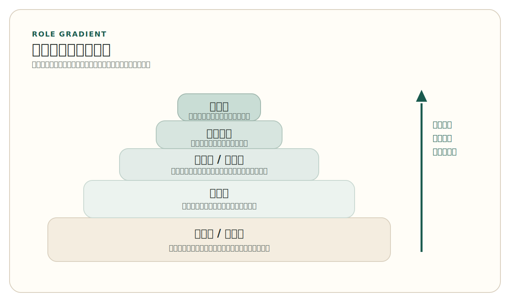
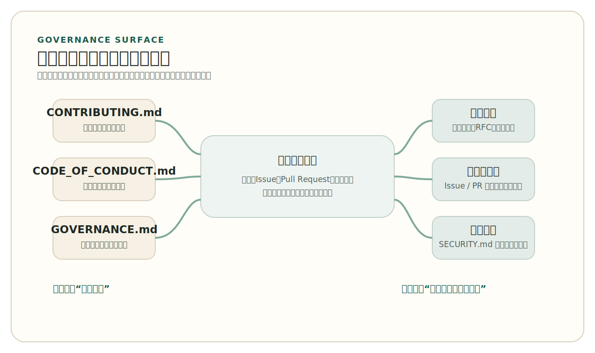

# 第 3 章 开源社区与治理

*Open Source Communities and Governance*

很多人第一次接触开源时，会把它想象成一种近乎自发的协作：代码公开了，感兴趣的人自然会加入，问题会被公开讨论，好的修改会被自动吸收，项目就会持续成长。只要真正观察几个经典项目，就会发现事情远没有这么简单。Linux 的补丁不会无序地直接流向主线，而是沿着维护者链条逐步流转；Apache 的项目也不是靠“谁都可以拍板”来运作，而是依赖 committers、PMC 和长期形成的社区规范。开源之所以能够成为公共协作系统，不是因为它没有组织，而是因为它把组织方式尽量公开、可追溯、可继承地写了出来。

第一章讨论了开源如何从一段历史问题逐步发展为现代软件世界的基础设施，第二章讨论了开源为何必须依赖许可证来明确权利与义务边界。本章则进一步回答另一个同样基础的问题：当陌生人围绕同一份代码、同一个项目、同一套目标展开长期协作时，这种协作是如何被组织起来的？谁可以做决定，谁承担维护责任，讨论为什么要尽量公开，行为边界和冲突处理为什么要写进文档，项目为什么需要关心维护者负担和社区健康？这些问题共同构成了开源治理。

本章不讨论具体平台按钮，也不展开 Pull Request、持续集成或发布自动化的工程细节。它更关心这些工程动作背后更稳定的一层结构：社区如何形成角色分工、治理规则和公共记录。只有这一层结构成立，后面关于贡献、评审、测试、发布和长期维护的讨论才有真正的基础。

## 1. 开源社区不是代码的附属物

如果把开源简单理解成“把代码放出来”，就很容易低估社区在其中的作用。源代码当然是开源对象的核心，但开源项目从来不只是一个文件集合。它还是一个围绕问题、目标、角色和规则形成的公共协作空间。人们不只是下载代码，还会提出问题、报告缺陷、补充文档、评审修改、争论路线、维护版本、解释边界。没有这些活动，仓库最多只是“可见代码”；有了这些活动，项目才逐步变成社区。

经典的“大教堂与集市”叙述，之所以长期有影响力，是因为它准确捕捉到了一点：开源项目往往不像传统封闭团队那样把信息完全锁在内部，而是把问题、修改和反馈暴露在更广的公共空间里。这个判断今天仍然有解释力，但如果把它当成全部答案，就会忽略现代开源最重要的一点：公开协作并不等于无结构协作。参与者越多、项目寿命越长、依赖范围越广，项目越需要清楚地回答一组治理问题：谁负责什么、讨论在哪里进行、什么能被接受、争议如何处理、怎样避免项目过度依赖少数人。

更准确地说，社区首先是一种上下文传递机制。代码可以告诉人们系统“现在是什么样”，却很少能单独解释系统“为什么会变成这样”。一个接口为什么保持兼容，某个设计为什么被长期拒绝，一条行为边界为什么被明确写入文档，一项需求为什么始终不在项目范围内，这些判断往往沉淀在公开讨论、版本说明、设计记录和维护者解释之中。没有这些上下文，后来者即使能读懂代码，也很难真正理解项目。

一个长期保留的工作项，常常就承担着这种上下文传递功能。它未必要长得很复杂，但通常会把问题、替代方案和最终判断串在一起。例如，一个典型的长期 `Issue` 记录可能会留下这样的轨迹：

```text
Issue #2481
- report: login fails behind reverse proxy
- discussion: preserve compatibility for existing clients
- decision: defer API redesign to 2.0
```

真正重要的不是这几行文字本身，而是它们把“问题为什么没有立刻按某种方式解决”写进了公共记录。对后来者来说，这类记录往往比只看当前代码状态更能解释项目为何会演化成今天的样子。

这也是为什么开源社区的参与者从来不只是一组“写代码的人”。成熟项目通常还需要文档维护者、缺陷分诊者、版本发布者、安全响应者、打包维护者、网站维护者以及负责组织公共讨论的人。这些工作未必都以新功能或新代码的形式出现，却共同决定一个项目能否被理解、被进入、被延续。把社区狭义地理解为“开发者社交圈”，会直接掩盖这些工作在开源中的技术地位。

这也是为什么“社区”不应被写成代码之外的软性附属物。对开源项目来说，社区承担的不是气氛营造，而是协作秩序。它让一个项目从“几个写代码的人”过渡到“一个可以被陌生人理解、进入、质疑和继承的公共系统”。很多项目之所以很难被参与，不是因为代码本身太复杂，而是因为上下文只掌握在少数人手里，规则没有写下来，决策路径不透明，外部人看不到自己应该从哪里进入，也看不到自己的工作会如何被判断。

从这个角度看，治理的意义并不是把一群自由协作者重新装进某种公司式层级，而是把原本依赖私人默契和熟人网络才能运转的知识，尽量转换成可共享的公共制度。只要一个项目仍然主要依赖“大家都知道该找谁”“内部人自然明白什么能做”“关键判断只在私下形成”，它就还没有真正建立起面向陌生协作者的开放结构。仓库是公开的，并不等于协作是公开的。

因此，治理首先要解决的不是“怎样管理别人”，而是“怎样让公共协作可以持续发生”。当一个项目把角色边界、沟通方式、进入路径和行为规范写清楚时，它并不是在模仿公司官僚流程，而是在减少公共协作的不确定性。对开源项目来说，清晰是一种开放条件。没有清晰，开放就很容易退化为表面的可见性。

> Note
> 开源项目看起来越“自由”，往往越需要一套可以公开解释的基本规则。真正的问题从来不是有没有规则，而是规则是否公开、是否一致、是否可以被后来者理解。

## 2. 角色、权力与责任如何被组织起来

几乎所有成熟的开源项目都会逐渐形成角色梯度。最外层通常是使用者，他们下载、运行、反馈问题、判断项目是否值得继续关注。再往里是贡献者，他们提交文档、测试、缺陷修复或功能修改。再往里可能出现评审者、维护者、核心团队、项目管理委员会或 steering council 等更稳定的角色。不同项目的名称不完全相同，但它们都在解决同一个问题：谁拥有什么权限，谁承担什么责任，谁可以对公共对象做出最终判断。

角色梯度并不是为了制造抽象的等级感，而是为了让权限、判断和责任可以逐层对应。一个人能否直接合并修改、能否发布版本、能否代表项目解释范围边界、能否处理社区争议，这些都不是象征性头衔，而是对公共对象的真实控制权。成熟项目通常不会把这种控制权完全模糊化，而会逐渐把它与具体职责绑定起来。也正因为如此，治理文本往往不仅要说明“谁可以做什么”，还要说明这些权限如何获得、在什么条件下失效，以及谁有权对其进行监督。

<div class="history-story">
  <p class="history-story-label">历史片段 Historical Story</p>
  <p>2018 年 7 月 12 日，围绕 PEP 572 的激烈争论刚刚落下，Guido van Rossum 向 <code>python-committers</code> 邮件列表发出一封标题为 “Transfer of power” 的邮件，宣布自己退出 BDFL 的最终决策角色，而且不会指定继任者。对外部旁观者来说，这像是一位长期核心人物的个人决定；但对 Python 社区来说，更尖锐的问题立刻浮现出来：如果项目不能再依赖单一人物做最后裁决，那么 PEP 由谁拍板，核心开发者由谁接纳，权力又该如何被约束？</p>
  <p>接下来几个月里，Python 社区没有把这个问题重新交还给新的个人权威，而是把它写成了治理文本。2019 年形成的 <code>PEP 13</code> 以 steering council、core team、选举机制和利益冲突限制为核心，把“谁负责什么、谁能做最后判断、怎样避免单一组织主导”正式写进了项目制度。这个转折之所以具有代表性，不只是因为 Python 很有名，而是因为它清楚地说明：成熟开源社区迟早要把“依赖某个人”转化为“依赖可继承的公共治理结构”。</p>
</div>

先把这条从外围参与到治理责任的梯度压缩成一张图，后面的 Linux、Apache 和 Python 案例会更容易定位。

<!-- figure-id: ch03-fig-01-community-role-gradient | core | status: final | source-trail: chapter 3 §2 narrative; fully redrawn -->
<figure class="book-figure">
  
  <figcaption>图 3-1 开源社区的角色梯度</figcaption>
</figure>

Linux 是理解这一点最经典的案例之一。很多人熟悉 Linux，是因为它规模巨大、影响广泛，但从治理角度看，它更重要的价值在于提供了一种极其清晰的维护者链条。内核补丁通常不会直接提交给 Linus Torvalds，而是先经过子系统维护者、相关维护者组和更高层整合，最后再进入主线。这种结构常被概括为一条“信任链”。它意味着开源项目的开放并不依赖每个人都能直接触达最高决策层，而是依赖不同层级维护者之间形成的长期判断与责任传递。这里的关键不是“Linus 一个人决定一切”，也不是“人人都能直接决定一切”，而是主线判断被放在一个公开但分层的结构里进行。

Linux 的治理价值还在于，它把技术权威牢牢系在具体子系统和长期维护责任上。谁负责某一部分代码，并不是一个抽象身份问题，而是补丁应该发给谁、谁最有能力判断修改影响、谁要对进入主线的内容承担解释义务的问题。维护者名单、公开评审和补丁流转路径因此共同构成了治理结构。对后来者来说，这种结构的意义非常现实：它告诉你项目不是“向一个巨大整体发言”，而是必须进入某个具体责任链条。

这种责任链条在 Linux 的 `MAINTAINERS` 文件里就能直接看到。一个典型条目常常会包含这样的字段：

```text
M: Maintainer Name
R: Reviewer Name
L: subsystem-list@example.org
F: drivers/example/
```

这里的重点不是记住字段缩写，而是看见治理如何被写进文件：谁负责、谁参与评审、讨论在哪里发生、哪些路径属于这一责任范围，都被放进了可公开查阅的仓库对象中。

Apache 则展示了另一种经典路径。Apache 的许多项目围绕 user、developer、committer、PMC member 这些角色组织起来。这里的关键词常被写成 meritocracy，但它更准确的含义并不是抽象的“精英主义”，而是持续贡献带来更高信任，更高信任意味着更高责任。committer 可以提交代码，PMC 则不仅关心代码本身，还要关心发布、项目方向、社区秩序和长期健康。与 Linux 的维护者链条相比，Apache 更强调社区化治理和项目层面的责任分担。两者不同，但共同点非常清楚：权限并不是天然平铺的，治理必须让“谁负责什么”逐步显性化。

Apache 这个案例尤其值得注意的地方，在于它把“社区重于代码”写成了一种运行原则，而不是口号。一个修改是否被接受，重要的不只是技术上能不能工作，还包括它是否符合项目当前方向、是否在合适的讨论中形成共识、是否由愿意长期承担责任的人来推进。很多 Apache 项目因此强调公开讨论、lazy consensus、投票与 PMC 责任，这说明社区治理并不是技术判断之外的额外层，而是技术判断得以稳定落地的制度环境。

在 Apache 常见的投票语义里，这种治理并不是抽象氛围，而是可直接执行的规则。一个简化后的表述大致像这样：

```text
+1  支持，并愿意为推进承担责任
 0  不反对，但不主动背书
-1  明确反对，并应给出理由
```

这类规则之所以重要，不在于项目必须永远依赖投票，而在于它把“赞成、保留和反对”从模糊态度变成了公共记录中的清楚信号。

Python 提供了第三种值得补充的视角。它的正式治理结构由 core team 和 steering council 组成，steering council 由 core team 选举产生。这个案例之所以重要，不只是因为它展示了“选举”这种形式，而是因为它把治理的另一层问题公开化了：成熟项目不仅要决定技术方向，还要维护语言与实现的质量和稳定性，保持社区健康，并处理潜在的权力失衡。例如，Python 的正式治理文本明确限制同一雇主在 steering council 中的人数上限，这说明治理不仅处理技术争议，也处理利益边界。

Python 还提醒人们，成熟社区迟早要面对“个人权威之后怎么办”的问题。只要一个项目真正足够重要、足够长寿，它就不可能永远建立在单一人物的个人魅力或历史地位之上。把治理结构正式写下来，把权力边界、选举机制和最终裁决职责明确下来，本质上是在把项目从“围绕某些核心人物运转”推进到“围绕可继承的公共制度运转”。这一步对长期项目极其关键。

把这几个经典案例放在一起，能够看到一个稳定结论：开源治理没有唯一正确模板，但成熟项目一定会回答三类问题。第一，角色如何进入与升级。第二，谁对项目的哪些部分承担判断责任。第三，权力如何被约束和解释。一个项目如果只有“核心开发者”这种模糊说法，却没有清楚说明贡献怎样被接纳、谁有最终判断权、争议怎样收敛，那么它的开放性通常会停留在表面。

进一步看，Linux、Apache 与 Python 分别强调了三种不同的治理重心。Linux 更强调围绕代码路径和维护责任形成的分层判断；Apache 更强调围绕社区与项目组织形成的责任共同体；Python 则更清楚地展示了正式治理文本如何处理继任、选举与利益边界。三者并不互相排斥，反而共同说明：治理不是某一种组织图，而是项目为“公共控制权”所设计的解释机制。

这也是为什么角色不只是“进入项目后的称号”，而是项目如何安排继任与持续性的线索。如果一个项目的关键工作永远只能由极少数不可替代的人承担，那么它的治理即使表面完整，也仍然非常脆弱。真正成熟的社区，通常会逐步让新人知道如何从外围进入，如何承担更具体的责任，以及如何在时间推移中接住前一代维护者留下的工作。

这也是为什么角色不是头衔，而是责任结构。对外部读者而言，看懂一个项目的角色分层，往往比看懂一段代码更重要，因为它直接决定你能否判断这个项目的运行方式，也决定你能否判断某个贡献路径是否真实存在。

## 3. 公开、异步、可归档沟通为什么是治理基础设施

一旦把开源理解为公共协作系统，就会发现沟通媒介本身也属于治理的一部分。成熟项目之所以强调公开、异步、可归档沟通，不是因为它们迷恋某种特定工具，而是因为公共记录能够解决三个基本问题：让后来者补齐上下文，让决策过程可回溯，让项目不至于过度依赖私人关系和即时口头沟通。

沟通方式之所以重要，是因为它直接决定谁能跟上项目的节奏。一个重大判断如果主要发生在熟人私聊、临时会议或少数人掌握的内部频道中，那么项目对外即使再开放，外部参与者看到的也只是已经形成的结论，而不是形成结论的过程。这样一来，后来者就很难判断某条规则为何存在、某次拒绝是否合理、某项设计是否还有讨论空间。治理并不只是“做决定”，同样重要的是让决定能够被外部人理解和追溯。

Linux 长期依赖公开邮件列表来承载补丁讨论和评审，这种方式并不“落后”，而是非常符合大规模基础设施项目的治理需求。补丁、回复、反对意见、修改建议都保留在公共记录里，参与者可以根据主题、抄送对象和讨论历史追踪上下文。这种可归档性非常关键，因为开源项目的参与者常常分布在不同时区、不同机构、不同工作节奏中。异步沟通让他们不需要同时在线，也让后来的维护者能够回看一项判断是如何形成的。

Apache 对这一点的表达同样清楚。它长期把邮件列表视为项目的“虚拟会议室”。这里重要的不是邮件这种具体技术，而是项目把公共讨论放在一个默认可见、可归档、可引用的位置上。与之对应，私下消息、即时聊天或线下讨论并不是不能存在，而是不适合承担项目普通治理的主要职责。否则，规则和上下文就会越来越集中到少数熟人之间，后来者看到的只是结论，而不是形成结论的过程。

这并不意味着同步沟通毫无价值。在线会议、即时聊天、线下峰会都可能帮助项目更快地交换信息、澄清误解或推动复杂问题向前走一步。但成熟社区通常会坚持一个更重要的原则：关键结论必须回到公开、可归档的渠道中。只有这样，沟通才不会在时间上断裂，也不会因为参与者更替而把制度记忆一起带走。

今天，许多公开代码托管平台又把这种治理基础设施进一步显性化了。一个成熟仓库往往会在显眼位置放出一组治理入口文件。`CONTRIBUTING.md` 不是简单告诉人们“欢迎贡献”，而是明确项目接收什么样的修改、怎样提交、怎样讨论、什么内容不在当前范围内。`CODE_OF_CONDUCT.md` 也不是礼貌倡议，它真正重要的部分在于说明行为边界、报告渠道和执行责任。Issue 模板和 Pull Request 模板的价值，则在于减少无效沟通，把公共记录组织得更可读、更便于维护。`SECURITY.md` 更进一步，把普通公开讨论与敏感漏洞报告分开，避免真正的安全问题在公开讨论中被错误暴露。

这些文件并不神秘，很多时候它们的结构本身就已经在说明治理逻辑。一个简化后的治理入口组，常常会呈现出这样的样貌：

```text
CONTRIBUTING.md
- how to report bugs
- how to propose changes
- what needs discussion first

CODE_OF_CONDUCT.md
- expected behavior
- reporting path
- enforcement responsibility

GOVERNANCE.md
- roles
- decision process
- release responsibility
```

即使不进入任何平台界面，只看这些文件名和条目，也能大致判断一个项目是否认真考虑过进入路径、行为边界和决策责任。

在不少项目中，这组文件还会进一步扩展为 `GOVERNANCE.md`、`MAINTAINERS`、RFC 或提案流程文档。它们的共同功能并不是展示“项目很正式”，而是把原本必须靠熟人讲解才能掌握的进入路径、责任边界和决策流程，转换成仓库中可直接阅读的公共接口。越是希望吸引陌生贡献者的项目，越需要这种显性的治理表面。

这些文件看起来分散，实际上共同构成了项目的“治理入口”。它们回答的是同一类问题：陌生人如何进入项目，怎样提交信息，怎样避免伤害，什么时候应该公开，什么时候必须转入更受控的报告路径。也正因为如此，这些文件不应被归类为仓库装饰，而应被视为现代开源治理在仓库层的最小显性结构。

如果把这些入口文件、记录渠道和例外通道收束成一个最小结构，大致会呈现下面这种关系。

<!-- figure-id: ch03-fig-02-governance-infrastructure | core | status: final | source-trail: chapter 3 §§3-4 narrative; fully redrawn -->
<figure class="book-figure">
  
  <figcaption>图 3-2 治理基础设施的最小显性结构</figcaption>
</figure>

治理的公开表面也不只存在于静态文件中。公开的问题跟踪、可见的发布计划、可回看的会议纪要或决策记录，同样属于治理基础设施。它们让外部人看到的，不只是项目宣称自己如何运作，还包括项目实际上如何安排优先级、处理积压、形成结论并推动版本向前。这种“运行中的公开证据”，对判断一个社区是否真正开放同样重要。

把沟通媒介和治理文件放在一起看，还会得到一个更深的判断：公共记录本身就是制度记忆。一个项目每一次设计分歧、每一次范围调整、每一次行为争议处理，都会逐渐沉淀出“这个社区如何思考和运转”的实际证据。后来者未必要逐字读完所有历史，但只要这些记录存在，项目就具备了把经验传递下去的可能。反过来，如果关键讨论总是消失在不可见渠道里，项目的制度就会长期依赖少数人的记忆力和解释权。

同时，公开原则也有明确边界。安全漏洞报告、骚扰或伤害事件处理、涉及个人隐私或法律风险的事项，通常不适合走普通公开讨论路径。恰恰因为现代治理重视公开，它也必须清楚界定何时应该转入更受控、更负责任的渠道。`SECURITY.md` 和行为准则中的报告机制，正是这种边界设计的一部分。

> Tip
> 判断一个项目是否真的对外开放时，不要只看它是否公开了代码。更值得先看的，是它是否提供了清楚的贡献入口、行为边界和问题报告路径。

## 4. 从治理文件到社区健康：可持续性不是自动出现的

一个项目即使已经有了治理文件，也不等于它天然健康。治理真正困难的地方，在于如何把这些规则转化为长期可持续的运行状态。很多人判断项目时习惯先看 star 数、下载量或社交平台热度，但这些指标最多只能说明项目是否“引人注意”，并不能说明社区是否真的健康。一个项目完全可能很有名，却长期积压问题、评审严重瓶颈、维护责任过度集中，或者只靠极少数人透支性工作维持表面活跃。

社区健康因此更接近一种运行状态，而不是道德评价。它关心的不是这个项目“形象好不好”，而是协作是否还能持续进行。贡献者能否得到合理响应，评审是否长期积压，关键知识是否只握在少数人手中，是否有人在负责整理问题、维护版本、补充文档、解释边界，这些都比表面的可见热度更能说明项目是否稳固。对外看起来很活跃的项目，也可能在内部早已积累了严重的治理债务。

因此，社区健康首先是一个治理问题。更值得关注的往往是这些信号：Issue 和变更请求的响应速度如何，贡献者是否能够留下来，维护责任是否被合理分散，是否存在明显的单点维护者风险，项目是否给后来者提供了逐步进入的路径。今天围绕开源社区健康已经形成了专门的指标框架，例如 CHAOSS 提供了一整套观察社区活跃、响应和可持续性的思路。对一般读者而言，不需要背诵指标名称，但至少应建立一个稳定判断：受关注不等于健康，热闹不等于可持续。

如果要把这种判断再具体一步，可以只记住几个很有代表性的指标名：`Time to First Response` 关心新问题多久得到第一次回应，`Change Request Reviews` 关心变更请求是否长期积压，`Bus Factor` 则提醒项目是否把关键知识过度集中在极少数人手里。它们并不能自动替代判断，但能帮助维护者把“社区到底哪里出了问题”问得更准确。

指标框架的真正价值，不在于把社区压缩成单一分数，而在于帮助项目提出更准确的问题。例如，一个仓库的 Pull Request 长期无人处理，究竟是因为维护者人数不足、评审权限过度集中，还是因为贡献入口不清楚导致大量低质量变更涌入？又例如，某个项目贡献者总数看起来不少，但真正能承担发布和架构判断的人始终只有极少数，这说明它的扩展主要停留在外围，而没有真正形成责任继承。数字不能替代判断，但可以帮助暴露问题结构。

维护者负担是这里最容易被忽视的一层。开源项目的开放性常常让外部人只看到“谁都可以提问题”，却看不到“总得有人持续处理这些问题”。维护者不仅要评审修改，还要维护方向、解释边界、拒绝不合适的请求、协调发布、处理冲突、回应安全问题。一个项目如果没有清晰的角色分工、没有进入路径、没有继任安排，就很容易把所有压力积到少数维护者身上。长远看，这种结构会直接削弱项目开放性，因为外部人会发现：规则虽然写着开放，但真正做判断的人已经没有足够时间和精力去支持新的参与。

许多项目的脆弱性并不是在代码层首先暴露出来，而是在维护负担分配上首先显现出来。问题分诊没有人做，版本发布总由同一两个人承担，关键目录长期只有单一评审者，文档和规则多年无人更新，这些都会让项目逐渐对外失去可进入性。治理在这里的作用，不只是“把人组织起来”，更是主动设计减压路径，例如把重复性工作分散出去，为新维护者建立可实践的进入阶梯，把高频公共解释写进文档，把关键责任从个人负担转化为社区流程。

健康的用户社区在这里也有实际作用。一个项目如果能让使用者之间形成相对良性的互助关系，很多常见问题、入门困惑和使用经验就不必全部压到核心维护者身上。用户社区当然不能替代核心技术判断，但它可以显著提高信息流动效率，并为后来者提供更低成本的进入路径。这同样属于社区健康的一部分。

继任问题同样属于社区健康的核心。任何重要项目都会面临人员流动、精力转移和组织变动。一个真正可持续的开源项目，不会假设核心维护者会永远稳定存在，而会逐步把知识、权限和责任做成可移交的结构。是否有人可以接替版本发布，是否有人能承担次级维护职责，是否存在明确的评审责任链条，是否能在关键人物离开后继续推进，这些都比短期热度更能说明项目的真实韧性。

企业参与则让治理问题进一步显性化。成熟开源项目几乎很难完全脱离公司支持，无论是开发者的全职时间、基础设施赞助，还是生态整合，企业都可能在其中扮演重要角色。问题不在于“有没有公司参与”，而在于这种参与是否透明，是否受治理机制约束，是否允许单一组织不成比例地影响项目方向。Apache 的基金会结构、Python 对治理层雇主人数的限制，都说明经典开源社区早就意识到：企业参与必须被公开化、规则化，否则项目很容易在形式上公开、实质上被单一力量主导。

对企业参与最稳妥的理解，不是把它简单区分为“污染”或“支持”，而是把它视为一种必须被治理吸收的现实条件。公司资源可能带来开发时间、基础设施和生态推广，也可能带来方向偏置、优先级挤压和控制权失衡。治理的任务不是否认这种力量存在，而是让它处在可解释、可监督、可平衡的制度框架内。基金会、公开选举、雇主限制、透明发布流程等安排，都是不同社区对这一问题的长期回应。

从这里再回看治理文件，就会明白它们为什么重要。`CONTRIBUTING.md` 不是为了显得专业，`CODE_OF_CONDUCT.md` 不是为了显得文明，治理模式也不是为了显得正式。它们真正的作用，是让项目在时间推移、人员变化和外部压力增加时，仍然能把协作维持在一个可解释、可继承的轨道上。没有这种轨道，项目越成功，往往越容易失控；有了这种轨道，项目才有可能从“有人维护”变成“可以持续被维护”。

这也意味着治理文件不是一次性装修，而应随着项目演化持续修订。一个多年未更新的贡献指南、一个没有执行路径的行为准则、一个写着开放却没有实际响应能力的治理结构，往往比完全没有文件更容易制造错误预期。真正有效的治理，不是把规则写出来就结束，而是让规则与社区的实际运行保持一致。

> Warning
> 对开源项目来说，最大的长期风险往往不是没有贡献者，而是项目看起来很开放，实际却只有极少数人知道怎样推动事情继续向前。

## 本章小结

开源的公开性并不意味着无组织，恰恰相反，它要求项目把原本可能隐藏在私人关系中的角色、规则、讨论和责任边界尽量公开化。Linux、Apache、Python 这些经典项目之所以能够长期运行，并不是因为它们没有权威，而是因为权威、责任和公共记录之间形成了相对清晰的结构。治理不是文化装饰，而是开源协作的基础设施。

理解了这一点，读者才会知道为什么一个项目需要贡献指南、行为准则、问题模板、报告渠道和正式治理结构，也才会明白社区健康、维护者负担、继任安排和企业参与透明度为什么都属于开源开发技术的一部分。真正成熟的开源项目，既要有可见的代码，也要有可解释的角色结构、可追溯的公共沟通和可延续的责任安排。只有治理结构成立，后续关于贡献、评审、测试、持续集成和发布的工程流程才有可能稳定展开。

下一章将从社区与治理转向工程流程，讨论开源项目如何通过版本控制、变更评审、测试与自动化机制，把这种公共协作进一步落实到日常开发实践中。

## 延伸阅读

- Linux kernel documentation, “The kernel development process”
- Linux kernel documentation, “How the development process works”
- Apache Software Foundation, “How the ASF Works”
- Guido van Rossum, “Transfer of power”
- Python Enhancement Proposals, “PEP 13 – Python Language Governance”
- GitHub Docs, “About community profiles for public repositories”
- Open Source Guides, “Leadership and Governance”
- Open Source Guides, “Your Code of Conduct”
- Open Source Guides, “Gathering Community Metrics”
- CHAOSS
