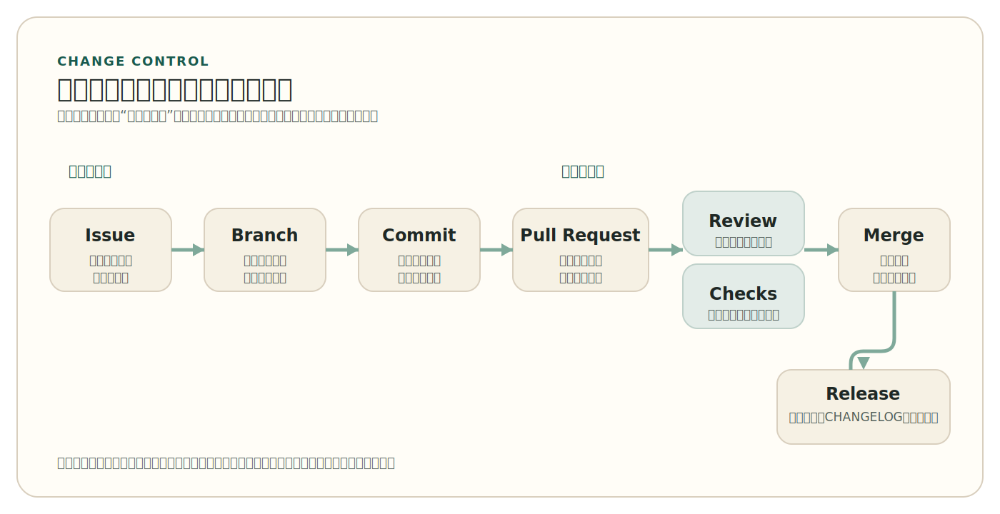

# 第 4 章 开源开发的基本工程流程

*Core Engineering Workflow of Open Source Development*

一个开源项目公开接受贡献，但默认分支却被规则“保护”起来：不能直接推送，修改必须先经过分支、Pull Request、Review 和检查门禁。很多刚接触开源的人会觉得这有些矛盾，既然项目鼓励协作，为什么不让修改更直接地进入主线？只要看一眼经典项目，就会明白这恰恰是开放协作能够成立的条件。Linux 用公开补丁流和维护者链条控制代码进入主线，今天的平台化仓库更多使用 branch-based workflow 和 Pull Request 流程；工具不同，但它们都在解决同一个问题：怎样让修改被隔离、被审查、被验证，然后再进入公共代码线。

第三章讨论了社区、角色和治理，说明开源并不是无组织协作。本章则进入治理在技术层上的具体表现：修改如何从一个想法变成工作项，如何被组织为分支和提交，如何进入 Pull Request，如何接受 Review、状态检查和自动化门禁，为什么依赖、密钥和自动化权限也要进入日常流程。理解了这一层，读者才会知道现代开源工程为什么不再只是“公开仓库 + 有人 review”，而是一个由版本控制、变更门禁、自动化检查和安全基线共同构成的协作系统。

本章不教授平台按钮，也不试图替代 Git 命令参考手册。它更关心长期稳定的一层抽象：现代开源开发为什么要围绕变更控制来组织工程流程。

## 1. 工程流程不是官僚负担，而是变更控制

开源项目之所以需要工程流程，首先不是因为参与者不值得信任，而是因为公共代码线必须保持可集成、可追溯、可维护。一个项目只要被多人使用、多人修改，默认分支就不再只是“最新代码所在位置”，而是整个项目的公共基线。别人会围绕它阅读、编译、测试、扩展、部署，甚至以它为依赖继续开发。也正因为如此，默认分支不能随意承载未经说明、未经验证、未经审查的修改。

这就是变更控制的起点。流程的存在，不是为了给贡献增加形式负担，而是为了在“大家都可以提出修改”与“主线不能被轻易破坏”之间建立一条缓冲区。Linux 的 patch flow 看起来与今天常见的 Pull Request 流程很不一样，但两者的共同点十分明显：修改不会直接无条件进入主线。它必须先被包装成一个可讨论对象，进入公开记录，被相关维护者或评审者检查，再在适当时机进入主线。这一点比具体工具更根本。

如果没有这条缓冲区，开放协作很快就会陷入两种极端。要么默认分支变得混乱，谁都不敢信任它；要么维护者只能依靠私下关系来筛选修改，导致流程对外表面开放、实质封闭。工程流程真正解决的，正是这个矛盾。它让每一组修改都先处在“提议中”“检查中”“待整合”的状态，而不是直接变成公共事实。

从这个角度看，工程流程其实是治理在技术层的延伸。第三章强调了角色、规则和公共记录，本章强调的则是：这些规则如何通过分支、审查、检查和门禁，变成不能轻易绕过的工程现实。真正成熟的开源项目，不会把流程理解为附属文书，而会把它视为主线稳定性的一部分。

默认分支之所以重要，还因为它在现代软件生态中常常承担外部契约的角色。别人可能直接从这个仓库构建软件，也可能围绕它开发插件、维护发行包、编写文档、建立二次集成。默认分支一旦频繁处于不可构建、不可测试、行为不明的状态，受影响的就不只是仓库内部开发者，而是围绕这条主线建立工作预期的整个外部生态。也正因为如此，流程不是为了让贡献显得“正式”，而是为了让公共基线可以被信任。

这也解释了为什么现代开源项目越来越强调“修改先作为提案存在”。提案状态意味着一组修改仍然处于可讨论、可拆分、可退回、可补充验证的阶段，还没有转化为主线事实。这个缓冲区看似增加了一步，实际上减少了后续大量返工，因为问题在合并前暴露，总比在默认分支、下游发行版或用户环境中暴露要便宜得多。流程真正保护的不是形式，而是集成成本。

因此，工程流程不应被理解成“对贡献者的额外考验”，而应被理解成项目为每一次变更建立最小可审查边界的方式。只要参与者不止一个，变更就必须能够被解释、被核查、被回顾。开源的开放性提高了修改进入项目的机会，也提高了主线被破坏的风险；流程的任务就是在这两者之间建立可持续的中间层。

> Note
> 开源项目中的“快”并不等于“谁都可以直接改主线”。更常见也更可靠的快，是让修改更快地被隔离、审查、验证并安全地进入主线。

## 2. 从工作项到变更集：Issue、Branch 与 Commit

流程的第一步，通常不是写代码，而是把模糊问题变成可追踪对象。`Issue` 在现代仓库中的作用，正是把缺陷、需求、任务或设计讨论从零散聊天转成可引用、可分派、可回溯的工作项。它让团队能够明确知道当前要解决什么问题，也让后来者能够知道某组修改为什么存在。一个没有工作项记录的仓库，往往会让提交历史显得像一连串孤立动作；而一旦工作项存在，代码修改就会被重新放回问题背景中理解。

工作项的价值还在于它把“问题本身”与“问题的一个可能解法”区分开来。一个缺陷为什么值得优先处理，一个需求是否真的在项目范围内，一项设计分歧是否需要先讨论再修改，这些判断都不应直接埋进代码差异里。`Issue` 让项目先把范围、背景和判断条件摆到台面上，再决定是否进入具体实现。这样一来，后面的分支和 Pull Request 才不是凭空出现的修改，而是有来路可查的工程响应。

`Issue` 也不是简单的任务堆放区。成熟项目通常会通过标签、里程碑、关闭或转移机制，对工作项做持续分诊和收束。否则，工作项系统很快就会堆满重复问题、过期请求和范围不明的讨论，反而削弱后续分支、Review 和版本计划的可读性。工作项之所以属于流程起点，正因为它不仅记录问题，也组织问题。

<div class="history-story">
  <p class="history-story-label">历史片段 Historical Story</p>
  <p>2005 年，Linux 内核社区突然发现，支撑自己多年协作的一块关键基础正在松动。自 2002 年起，内核开发大量依赖名为 BitKeeper 的分布式版本控制工具；但到 2005 年，Linux 社区与 BitKeeper 背后公司的关系破裂，原先免费的使用条件被撤回。对于一个补丁每天都在流动、维护者遍布世界各地、分支同时并行推进的大型项目来说，这不是“换个软件继续干”的小插曲，而是整个协作流程随时可能失去支撑的时刻。</p>
  <p>Linus Torvalds 随后着手开发 Git。后来 Git 官方历史回顾把这段起点描述为一次带着争议的“创造性破坏”，但它真正说明的问题更朴素：现代开源工程流程不是先有一套漂亮工具，再去寻找用途；恰恰相反，是像 Linux 这样的大型项目先碰到了真实的变更控制压力，才逼着社区把速度、分支并行、分布式协作和大规模历史管理做成新的基础设施。今天人们习以为常的 branch、merge、history 和 review 背后，本来就是这种工程压力的产物。</p>
</div>

接下来是分支。Git 的 branching model 之所以在开源协作中格外重要，不只是因为它灵活，而是因为它让每组修改都可以从默认分支隔离出来。隔离意味着两个好处。第一，不同工作可以并行推进，而不会相互污染。第二，默认分支在修改尚未准备好之前，不必承担这些中间状态。现代开源协作大量依赖这一点，因为公开仓库中的修改并不是同时、同地、同节奏完成的。没有低成本分支，公开协作就很难在不破坏主线的前提下扩展规模。

这里还隐藏着一个常被忽视的判断：分支不是为了“保存副本”，而是为了为一组修改建立边界。边界一旦清楚，项目就更容易判断这组修改应由谁 review、需要经过哪些检查、是否应该拆分、是否适合当前版本周期。没有边界，后面的评审与自动化就只能面对混杂变更。也正因为如此，分支的工程意义首先在于组织变更，而不是备份文件。

分支真正好的用法，不是把它当作长期堆积杂项的仓库，而是围绕一组相对独立的修改建立一条清晰开发线。一个分支最好能够回答：它解决什么问题，它对应哪个工作项，它为什么应该作为一组修改被一起审查。只有这样，后面的 Pull Request 和 Review 才不会面对混杂不清的变更。

Commit 则是流程中的最小历史单元。一次好的提交，不只是把文件状态保存下来，更是在历史里留下一个清楚边界：这次改动做了什么，为什么这样做，它与前后修改的关系是什么。提交越是混乱，Review 越难进行，回滚越困难，后来者越难理解项目为何演化到当前状态。现代开源流程虽然常常在 Pull Request 层面讨论修改，但 Pull Request 的可审查性很大程度上仍然取决于提交质量。

提交历史的质量之所以重要，是因为它不仅服务于当下的 review，也服务于未来的问题定位和责任追踪。一个缺陷在几个月后被发现时，维护者常常需要沿着提交历史回看：哪个变更引入了行为差异，当时为什么这样设计，是否可以只回滚某一部分而不影响其他修改。提交如果缺乏边界和说明，历史就会失去作为工程证据的价值。对公共仓库来说，提交记录不是开发者个人备忘录，而是项目记忆的一部分。

一个可审查的提交标题，通常会直接把变更边界写出来。例如：

```text
fix(ci): fail pull requests when required tests break
```

这样的标题之所以有用，不在于它是否严格遵循某一套命名约定，而在于后来者一眼就能知道：这次修改围绕 CI 门禁行为，目标是避免未通过测试的修改继续进入审查和合并流程。提交信息一旦能承担这种边界说明作用，Pull Request 的历史就会更容易被理解。

这一层逻辑对 shared repository model 与 fork-and-pull model 都成立。二者表面差异很大，一个更常见于有直接写权限的协作成员，另一个更常见于外部贡献者先在自己的副本上修改；但只要修改最终要进入同一条公共主线，它们都离不开相同的基本动作：工作项要有上下文，分支要隔离边界，提交要能说明历史。工具路径不同，不改变工程对象的基本要求。

这一节最需要建立的判断是：`Issue`、Branch、Commit 不是彼此孤立的对象。它们共同把一个问题逐步收束为一组可处理、可说明、可回顾的工程修改。对共享仓库模型和 fork-and-pull 模型而言，这条逻辑都成立。不同之处只在于修改是先发生在同一仓库中的协作分支，还是先发生在贡献者自己的副本中；共同点则是，修改在进入主线前必须被隔离并清楚描述。

把本章后面会反复出现的对象先压缩成一条最小链条，大致如下。

<!-- figure-id: ch04-fig-01-change-control-flow | core | status: final | source-trail: chapter 4 sections 2-5 narrative; fully redrawn -->
<figure class="book-figure">
  
  <figcaption>图 4-1 从工作项到发布的最小变更控制链</figcaption>
</figure>

## 3. Pull Request、Review 与 Merge：让修改变成可判断对象

如果说分支让修改被隔离出来，那么 Pull Request 则让它成为一个可判断对象。它的意义不只是“把代码交给维护者”，更是把一组修改、相关工作项、提交历史、讨论记录和后续修订汇总在同一个公共空间里。一个成熟项目之所以越来越依赖 Pull Request，并不是因为平台把它设计得显眼，而是因为它很好地承载了变更提案的核心需求：修改必须先被看见、被理解、被质疑、被修正，然后才进入主线。

这也是为什么 Review 不能被理解成礼貌性帮助。现代仓库中的 review 通常至少区分 comment、approve 和 request changes 这几类结果。它们代表的不是情绪，而是技术判断在流程中的位置。comment 说明仍有讨论空间，approve 表示当前修改可以接受，request changes 则意味着修改尚不满足进入主线的条件。一旦项目把 required reviews 与规则门禁结合起来，review 就从“建议”变成了真实的合并条件。

Pull Request 之所以成为现代协作中心对象，还因为它把不同类型的工程证据汇集到了同一处。这里既有 diff，也有提交历史、工作项关联、自动化检查结果、评审讨论以及后续修订。换句话说，Pull Request 不是单纯“交代码”的地方，而是项目对一组修改进行公共判断的工作台。只要把它仅仅看作提交通道，就会低估它在现代开源流程中的真正地位。

一个典型的 Pull Request，即使不看具体平台界面，也往往包含这样几类对象：

- 标题：说明这组修改想解决什么问题
- 描述：补充背景、范围、关联 `Issue` 和可能的风险
- diff：让评审者看到实际改了哪些文件和代码
- checks：显示测试、构建、lint 或依赖检查是否通过
- review：记录 comment、approve 或 request changes
- merge 条件：说明还缺哪些批准、检查或冲突处理

正是因为这些对象被放在同一个公共空间里，Pull Request 才不仅是“交代码”，而是让变更在进入主线前接受集中判断的地方。

`CODEOWNERS` 进一步把这种责任分层显性化。它并不是一个联系人名单，而是一种路径级别的评审责任映射机制。某些目录、文件或模块一旦被修改，就应自动请求相应代码所有者进行 review。对大型项目来说，这非常关键，因为它能把“谁最有责任看这部分修改”从默契变成明文规则。对维护者而言，这减少了人工分发审核责任的成本；对贡献者而言，这提高了评审路径的可预测性。

一个极小的 `CODEOWNERS` 片段往往就已经能体现这种映射关系：

```text
/docs/      @docs-maintainers
/src/auth/  @backend-maintainers
```

真正重要的不是条目数量，而是项目把“路径”和“责任”直接绑在了一起。这样一来，评审责任就不再只是口头分工，而成了仓库里可执行、可追踪的规则。

rulesets 或 branch protection 则把这些规则进一步从“约定”变成“不能轻易绕过的门禁”。项目可以要求：所有修改必须通过 Pull Request 进入目标分支，必须获得足够数量的审批，必须由 code owners 通过，必须先解决对话中的问题，必须让 required checks 全部通过，甚至还可以限制允许使用的 merge method。到这一步，Pull Request 就不再只是交流容器，而成为现代开源工程的中心对象。主线接受什么修改，不再靠临时判断，而靠事先配置好的可执行规则。

合并动作本身也值得单独理解。对许多贡献者来说，合并像是流程最后一个机械步骤，但它实际决定了修改如何进入公共历史。项目选择保留完整分支历史、压缩成单次提交，还是采用其他历史整理方式，本质上都在回答同一个问题：项目希望未来的人如何阅读这段变更历史。不同项目可以做不同选择，但成熟项目通常不会把这一点留给随意操作，而会与 review 和规则门禁一起纳入统一流程。

一旦把这一层看清，就会发现 Pull Request 的真正价值并不是“网页上有个按钮”，而是它让变更被包裹成一个可审查、可阻挡、可修订、可整合的对象。Linux 的 patch-based flow 虽然不依赖同样的界面容器，但其工程含义并没有不同：补丁也必须先被公开提出、被讨论、被修改、被接受或被拒绝。平台形式在变，变更控制的核心问题不变。

需要注意的是，Pull Request 不是唯一可能的协作形式。Linux 长期使用 patch-based flow，这提醒读者不要把平台机制当作全部开源经验。但从工程抽象上看，两者在解决同一个问题：修改必须先作为一个可讨论、可拒绝、可修订的对象存在，而不是直接成为主线内容。理解了这一点，读者就不会把 Pull Request 误看成平台礼仪，而会把它理解为现代开源仓库中的变更控制单元。

> Tip
> 判断一个 Pull Request 是否容易被 review，往往先看它是否围绕单一工作项、修改边界是否清楚、提交历史是否可读，而不是先看代码量大小。

## 4. 测试、CI 与自动化门禁

当一组修改已经能被讨论和评审后，下一个问题就是：如何避免所有判断都依赖人工眼力。现代开源工程对这个问题的回答是，把尽可能多的可重复检查前置到合并前。测试、构建验证、lint、静态分析、依赖检查等自动化步骤之所以重要，不是因为它们替代人类判断，而是因为它们把大量机械性、容易遗漏的判断从“评审者自己记得去做”转化成“系统先做一遍”。

这就是持续集成（CI）在开源项目中的基本位置。CI 不应被缩减成“自动跑单元测试”，更准确的理解是：它是仓库中的自动化政策执行。workflow 文件之所以被放在仓库里，就是因为它们本质上也是项目规则的一部分。项目选择在什么事件上触发哪些 jobs，要求哪些检查必须通过，本身就在定义“什么样的修改才算达到进入主线的最低条件”。

一个最小的 workflow 文件，往往已经能把这种“仓库政策”表达出来：

```yaml
name: ci
on:
  pull_request:
jobs:
  test:
    runs-on: ubuntu-latest
    steps:
      - uses: actions/checkout@v4
      - run: make test
```

这里最值得观察的，不是某一家的语法细节，而是两件事：它把检查绑定在 `pull_request` 事件上；它把“测试必须运行”写成了仓库里公开可见的规则。到这一步，CI 就不再只是维护者脑中的习惯，而成了项目对所有贡献者一视同仁施加的最低门槛。

GitHub 等平台把这一点表达得很清楚：workflow 是 configurable automated process，状态检查则是这些流程执行后的可见结果。一旦某些检查被设为 required，它们就不再只是“建议运行的流程”，而是合并门禁的一部分。这样一来，测试、lint、build、依赖扫描等要求就不必依赖维护者逐条记忆，而是通过系统持续执行。

这对开源项目尤其重要，因为开源协作的一个现实条件是：贡献者和维护者通常并不共享完全相同的开发环境，也不共享完全相同的时间节奏。自动化检查的价值，就在于为这些异步、分布式修改建立一条相对一致的最低验证线。哪怕它不能发现所有问题，也能显著减少“看起来没问题，合进主线才坏掉”的情况。

流程在这里出现了一个重要升级：从“修改被人工看过”升级为“修改既被人工看过，也经过了最低限度自动验证”。现代开源项目对主线质量的要求，越来越依赖这两层结合，而不是二选一。人工 review 擅长判断设计、边界和上下文，自动化检查擅长处理重复、机械和高频验证。把两者放在一起，才构成较完整的合并前防线。

CI 之所以应被视为仓库政策，而不是附属脚本，还因为它明确规定了项目愿意为主线承担什么样的最低质量门槛。有的项目要求每次修改都必须通过构建和测试；有的还会加入格式检查、静态分析、许可证检查、依赖风险检查或文档生成验证。具体组合可以不同，但共同点很稳定：项目把“什么叫做最低可接受修改”部分交给自动化持续执行，而不是每次都靠人工从头记忆。

这也意味着自动化质量本身是工程流程的一部分。一个经常失败、速度极慢、结果不稳定的 CI 系统，不只是“工具不好用”，而是在削弱 review 和合并门禁的可信度。维护者会逐渐习惯性忽略失败，贡献者会把检查视为噪声，主线质量也会因此变得更难保障。成熟项目之所以重视 CI，不只是因为它能发现问题，还因为它能把共同规则以一致方式施加到每一次变更上。

如果把前面出现过的关键对象放到同一张表里，它们在流程中的分工会更清楚。

<!-- figure-id: ch04-tab-01-change-control-objects | core | status: final | source-trail: chapter 4 sections 2-4; change-control object mapping; fully rewritten -->
<p class="book-table-caption">表 4-1 开源变更控制中的关键对象与分工</p>

| 对象 | 在流程中的作用 | 主要回答的问题 | 进入下一步前要满足什么 |
| --- | --- | --- | --- |
| `Issue` | 把模糊问题变成可追踪工作项 | 这次修改为什么存在、范围是否成立 | 问题背景、范围和优先级至少基本清楚 |
| Branch | 为一组修改建立隔离边界 | 这组工作是否能与主线和其他工作分开推进 | 修改边界清楚，不与无关工作混杂 |
| Commit | 留下最小历史单元 | 具体改了什么、为什么这样改 | 标题和历史边界可读，可支持 review 与回滚 |
| Pull Request | 把变更包装成公共判断对象 | 这组修改是否值得进入主线 | 描述、diff、关联上下文和风险说明基本完整 |
| Review | 提供人工判断与责任分层 | 设计、边界和修改质量是否可接受 | 关键评审意见被处理，必要批准已获得 |
| CI / Checks | 提供自动化验证 | 修改是否通过最低限度的可重复检查 | 必需测试、构建或依赖检查通过 |
| Rules / Merge | 把约定变成可执行门禁 | 主线是否允许这组修改进入公共历史 | 评审、检查和分支保护条件全部满足 |

## 5. 安全与发布基线：依赖、密钥与可验证发布

如果说测试和 CI 主要回答“这组修改是否工作正常”，那么现代开源流程还必须回答另外几个问题：这组修改是否引入了有风险依赖，是否泄露了凭据，自动化本身是否拿了过大的权限，以及合并后的产物是否能被更可靠地说明来源。这些问题过去常被留到发布前或事故后处理，但今天越来越多地被前移到日常流程中。

依赖审查就是一个典型例子。现代项目的许多风险并不来自自己写的新代码，而来自 Pull Request 带入的依赖变化。dependency review 之所以重要，在于它让维护者能够在合并前看到：某个依赖是新增、删除还是升级，它是否带来已知漏洞或显著风险。这样一来，依赖就不再是“反正装上能跑就行”的外围问题，而是进入了变更审查本身。

密钥与凭据问题同样如此。过去的经验法则是“不要把密钥提交到仓库”，但现代平台已经把这件事工程化了。secret scanning 用于在仓库历史、Issues、Pull Requests、Discussions 等位置发现可能暴露的凭据，push protection 则进一步把发现型控制向前推进，在推送时就尽量拦截明显的泄露。这里最值得记住的不是某个具体功能名称，而是安全要求已经从“开发者个人自律”逐步变成“流程中的可检查对象”。

自动化权限也需要同样的治理思路。工作流并不是天然安全的协作者。只要自动化持有过大的令牌权限或可以访问过多 secrets，它就可能成为新的风险入口。也正因为如此，现代仓库越来越强调 least privilege automation。自动化应只拿到完成当前任务所需的最低权限，而不是因为方便就默认赋予更大能力。这一点听起来像安全原则，实际上同样属于工程流程设计。

发布问题则把这条主线延伸到了更靠后的阶段。对许多项目而言，一次修改在通过 review 和 checks 后已经可以进入主线，但“进入主线”并不自动等于“达到可发布状态”。版本号、变更记录、发布说明仍然是软件工程中面向使用者的重要界面。对大多数项目来说，更稳妥的基线顺序通常是：先把依赖审查、密钥保护、自动化权限和清楚的版本说明建立起来；再在需要更高发布完整性时，引入 SBOM 和 artifact attestations 这样的进阶机制。后者不是不重要，而是更适合被理解为可验证发布的增强层。

这里最值得建立的判断，是“可合并”与“可发布”之间始终存在一道额外门槛。某组修改可以安全进入主线，并不意味着项目已经准备好对外声明一个新版本、更新兼容性预期、发布变更记录并承担相应支持责任。很多项目的问题并不是代码不能写，而是主线状态、版本边界和发布说明之间缺乏清楚关系。版本管理、变更记录和发布说明之所以长期重要，正是因为它们把内部工程状态翻译成外部使用者可以理解的承诺。

标签、版本号和 changelog 因而不只是发布时的包装动作，而是项目对外说明“这次到底交付了什么”的公共接口。使用者并不会逐条阅读提交历史来理解一次发布，他们更依赖版本边界、破坏性变化说明、修复摘要和兼容性提示来做采用判断。一个项目如果只有不断前进的主线，却缺乏清楚的版本与变更说明，就很难让外部人稳定复用。这也是为什么发布完整性不只是构件来源问题，同样包括语义和沟通边界问题。

一个极小的发布说明片段，往往就能体现这种公共接口的作用：

```text
## 1.4.0

### Changed
- Require review before merge into the default branch

### Fixed
- Ignore duplicate labels in issue triage
```

项目真正向外发布的，并不是“最近仓库里发生了很多提交”，而是“这个版本边界内到底改变了什么”。`CHANGELOG`、release notes 和版本标签共同承担的，就是这种把内部历史翻译成外部承诺的工作。

从这个角度看，安全与发布并不是流程尾部的独立附录，而是变更控制在更大范围内的延伸。依赖是否可信、凭据是否泄露、自动化是否过权、构件是否可追溯，最终都在回答同一个问题：项目如何证明它交付出去的不只是“能跑的代码”，而是来源更清楚、风险更可控、边界更可解释的软件产物。现代开源工程之所以越来越重视这些内容，是因为公共软件一旦进入广泛复用环境，其责任范围就不再局限于仓库内部。

> Warning
> 在现代开源项目里，真正危险的往往不是“有没有安全功能开关”，而是团队仍然把依赖、密钥和自动化权限当作主流程之外的外围小事。

## 本章小结

现代开源开发的核心，不是“每个人都能直接修改公共代码”，而是“每一组修改都要经过隔离、说明、审查、验证和整合”。`Issue`、Branch、Commit、Pull Request、Review、Checks、Rules 这些对象之所以重要，并不是因为平台要求，而是因为它们共同构成了变更控制体系。没有这套体系，开放协作很容易要么失控，要么退回私人协调。

对今天的开源项目来说，流程也不再只关心代码能否合并。测试、CI、依赖审查、密钥保护、自动化权限、版本与发布完整性，已经逐步进入日常工程基线。理解了这一点，读者才会知道一次贡献不仅是“写出代码”，还包括把修改包装成可理解、可审查、可验证、可合并的工程对象。

下一章将从流程零件转向项目整体，讨论当读者面对一个陌生仓库时，如何综合许可证、治理文件和工程流程，对项目的健康度、可参与性和可复用性做出更完整的判断。

## 延伸阅读

- Git, “Branching and Merging”
- Git, “A Short History of Git”
- GitHub Docs, “GitHub flow”
- GitHub Docs, “About pull requests”
- GitHub Docs, “About pull request reviews”
- GitHub Docs, “About code owners”
- GitHub Docs, “Workflows”
- GitHub Docs, “About dependency review”
- GitHub Docs, “About secret scanning”
