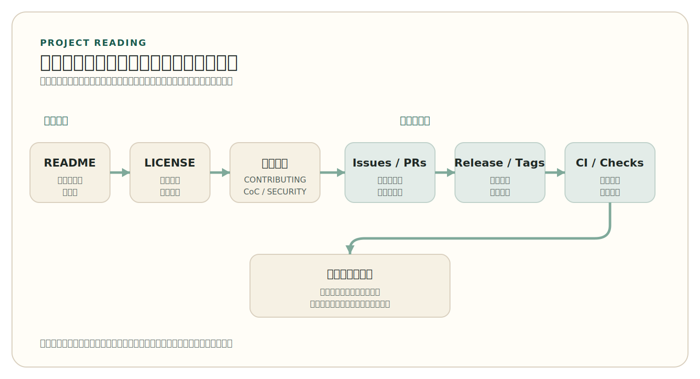
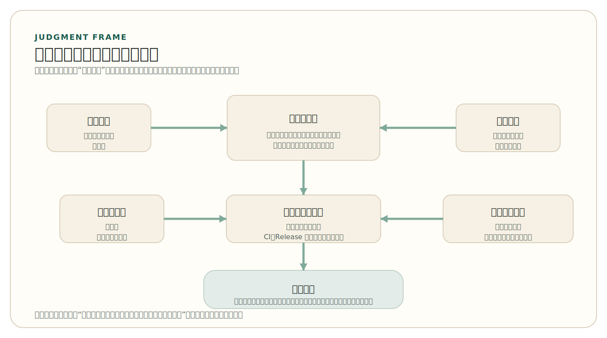

# 第 5 章 阅读与理解开源项目

如果一个读者今天同时打开 Linux 的 GitHub 镜像入口和 OpenClaw 的 GitHub 仓库，他很快就会意识到，“看仓库”根本不是一个统一动作。前者首先映入眼帘的，往往是 `Documentation`、`MAINTAINERS`、`Kconfig`、`arch/` 这类基础设施项目特有的入口；后者则更直接地把 `CONTRIBUTING.md`、`CHANGELOG.md`、`.github/`、安装文档和配置说明摆在前面，像是在邀请外部人沿着公共入口向里走。两个项目都公开，两个项目都重要，但它们要求读者建立的第一轮判断并不相同。

前四章分别讨论了历史、许可证、治理与工程流程，读者已经见过不少“零件”：`LICENSE` 是什么，`CONTRIBUTING.md` 为什么重要，`Issue` 和 Pull Request 如何进入项目，测试与持续集成（`CI`）为什么要成为日常门禁。但当这些零件真正出现在一个陌生仓库里时，新的困难才会出现。大多数人第一次面对真实开源项目时，不是不认识某个单独对象，而是不知道应当怎样把这些对象重新组合成一个整体判断：这个项目到底在解决什么问题？它是否仍在被维护？它是否适合学习、复用或参与？自己又该从哪里开始进入？

因此，本章要讨论的不是“再看一遍 README、Issue 和 Release”，而是如何形成项目级的阅读能力。阅读一个开源项目，既不是从头到尾浏览所有文件，也不是只看 star 数和热度排行。更可靠的做法，是沿着项目定位、仓库入口、治理信号、工程对象和参与路径，逐步建立一张整体认知图。只有这张图成立，读者才能把前四章获得的零散认知真正转化为判断能力。

## 1. 阅读项目，先建立整体问题意识

阅读开源项目的第一步，不是立即进入代码，而是先回答几个更基础的问题：项目面向谁，解决什么问题，它处在什么发展阶段，外部使用者为什么会依赖它。一个项目如果连目标对象、用途边界和基本定位都不清楚，那么后面看到的目录结构、接口命名和工作流记录都会失去上下文。反过来，只要先把“它为何存在”这件事大致看清楚，很多看似分散的仓库对象就会自动回到应有的位置。

这也是为什么项目阅读首先是一种评估活动，而不是纯粹的信息收集。读者关心的不是仓库里“都有什么”，而是这些对象是否共同说明了一个稳定的软件项目。README、项目主页、文档站点、安装方式、示例、版本历史和贡献入口，实际上都在回答同一件事：这个仓库究竟只是若干文件的堆放，还是一个可以被理解、被使用、被继续维护的公共项目。

这里尤其要区分“仓库”与“项目”这两个层次。仓库是载体，项目则是围绕问题、使用者、版本承诺和协作规则组织起来的公共对象。一个短期练习仓库、一个长期维护的基础设施项目、一个面向终端使用者的现代工具项目，虽然都可能托管在 GitHub 上，但读者对它们的判断标准并不完全相同。真正成熟的项目，通常会把自己为什么存在、由谁维护、怎样参与、怎样发布这些问题写到公共界面上；而不是要求后来者先读懂大量源代码，才能勉强猜出项目在做什么。

Linux 与 OpenClaw 的差异，恰好能够说明这一点。前者的公共入口更深，往往要继续进入 `Documentation` 和 `MAINTAINERS`，项目的协作结构才逐渐显现；后者则更早把 `CONTRIBUTING.md`、`CHANGELOG.md`、`.github/` 和文档入口摆在外部人面前。差异不在于谁更“现代”，而在于项目如何把自己的公共性表达出来。

不少中型、GitHub-native 项目则常处在两者之间。像 `tldr-pages/tldr` 这样的项目，既不像 Linux 那样要求读者先理解长期形成的维护者链条，也不像 OpenClaw 那样把大量安装、配置和安全边界前置到首页；但它仍会通过 `README.md`、`CONTRIBUTING.md`、`GOVERNANCE.md`、`MAINTAINERS.md`、`.github/` 和工作流文件，把进入路径、协作规则和项目状态以更标准化的仓库方式公开出来。这类项目很适合作为读者建立“中间层判断能力”的样本。

因此，项目阅读并不是“先把代码看懂，再说别的”，而是先建立一张问题地图：项目在解决什么问题，它对外提供了哪些入口，维护者如何组织公共协作，当前状态是否值得继续深入。只有这些问题先被大致回答，代码阅读才不会沦为脱离上下文的漫游。

> 注
> 项目阅读并不是降低对代码的重视，而是把代码重新放回项目语境中理解。没有这一步，读者往往会在实现细节里停留很久，却仍然说不清项目的定位、状态与进入路径。

## 2. 第一遍进入陌生仓库时，先看什么

面对陌生项目时，更稳妥的顺序通常是先看入口层对象，再逐步下沉到结构层和实现层。入口层并不解释全部技术细节，但它们最容易揭示项目是否具备公共性：项目是否说明了用途、适用对象、安装运行方式、版本边界和参与路径，维护者是否愿意把这些信息明确写给外部人看。

第一遍进入陌生项目时，一条成本较低、也较稳定的阅读路径通常如下。

<!-- figure-id: ch05-fig-01-project-reading-sequence | core | status: final | source-trail: chapter 5 sections 1-2 narrative; GitHub Docs community profile / project exploration structure; fully redrawn -->
<figure class="book-figure">
  
  <figcaption>图 5-1 第一遍进入陌生项目时的低成本阅读路径</figcaption>
</figure>

- `README` 与项目主页：先看项目宣称自己在做什么、面向谁、如何安装或试用、当前是否仍建议外部人使用。很多项目的第一层定位差异，光看这里就已经很明显。
- `LICENSE`：再看制度边界。读者不需要在这里重学一遍许可证概念，但至少要知道这个项目是否允许复用、分发和继续修改，以及它的制度立场更接近哪一类传统。
- `CONTRIBUTING.md`、`CODE_OF_CONDUCT.md`、`SECURITY.md`、`.github/`：这些文件和目录共同说明“外部人如何进入项目”。GitHub 把 README、许可证、行为准则、贡献说明和安全策略等对象汇成一组可见的社区资料视图（`community profile`），本质上就是在提示读者：项目有没有把最基本的公共入口写出来。
- 最近的 `Issues` 与 Pull Requests：它们揭示项目当前正在处理什么问题、讨论如何发生、维护者是否响应、评审是否堆积。这里看的是协作活动，而不是热闹程度。
- `Release`、`Tags`、`CHANGELOG` 与版本说明：这些对象说明项目是否在向外部承担清楚的版本边界，以及维护节奏是否还能被读者理解。
- `Actions`、工作流文件和检查状态：它们是项目工程状态的外部痕迹。第一遍阅读时不需要逐条分析自动化脚本，但至少要知道项目是否仍在用测试、构建和检查门禁保护主线。

**行走式阅读演示：以 `tldr-pages/tldr` 为例。** 如果顺着这条路径真正走一圈，读者通常会先在 `README.md` 里确认三件事：项目要解决的问题是什么，面向的是哪类使用者，仓库里的主要内容为何不是单一程序而是一整套可持续维护的命令速查页。继续看 `LICENSE.md`，就能迅速把制度边界放到位，知道这个项目的复用阻力大致处在哪个层级。再打开 `CONTRIBUTING.md`，阅读动作就会从“它是什么”转向“外部人如何进入”：页面格式、提交流程、基本风格和协作约束是否已经被明确写给贡献者，而不是要求后来者自己猜。

接下来再去看最近的 `Issues` 与 Pull Requests，目的不是看它热不热闹，而是验证前面这些入口文件是不是仍然在工作。维护者是否回应，讨论是否沿着公开路径发生，修改是否真的通过可见的协作界面进入主线，这些都会比仓库首页的宣传语更能说明项目状态。然后再看 `Tags`、版本记录和 `.github/workflows/`，读者就能补上另外两块关键信息：项目是不是处在持续维护之中，主线是不是仍由公开的自动化检查保护。

走完这一圈，读者未必已经理解 `pages/` 目录内部的全部组织方式，但已经足以形成第一轮判断：这是一个定位清楚、制度边界明确、贡献入口公开、协作活动可见、工程门禁也对外暴露的项目，因此很适合作为第一次练习项目阅读和小规模贡献的对象。这个演示的意义不在于把 `tldr-pages/tldr` 本身讲透，而在于说明项目阅读的核心动作其实是沿着“定位、边界、入口、活动、发布与检查”的顺序，逐步减少不确定性。

如果第一轮判断值得继续，阅读就不应停在网页上。更稳妥的下一步，是把仓库拉到本地副本中，再做第二层阅读。这里的目标不是立刻把环境全部跑起来，而是先识别实现层的几类对象：入口文件通常告诉你程序从哪里开始，配置文件告诉你构建和依赖边界，`tests/` 或测试脚本告诉你质量保障是否真实存在，`docs/`、`examples/` 和 `scripts/` 则说明项目如何把使用、验证与维护活动外显出来。网页阅读回答“这个项目值不值得继续看”，本地阅读则开始回答“如果继续，我该先理解哪一层结构”。

以 `tldr-pages/tldr` 为例，进入本地目录后，很快就会发现这个项目的主体不是传统意义上的 `src/` 应用，而是以 `pages/` 这类内容资产为中心组织起来的仓库。对这样的项目，读者下一步应优先理解页面组织规则、校验脚本和自动化如何围绕这些页面运作，而不是误以为必须先找到一个大型核心代码目录才能继续理解它。反过来，如果面对的是 Linux 这类基础设施项目，目录树本身就会立刻暴露出子系统分层、架构分布和维护边界；这说明实现层阅读同样要从“项目是什么类型”出发，而不是套用单一模板。

如果把对象换成 `VS Code` 这样的代码型仓库，第二层阅读的重心又会不同。它的代码树和子系统比 `tldr-pages/tldr` 更复杂，但读者并不需要一开始就扎进所有目录。更低成本的做法，是先把 `src/`、`extensions/`、`test/`、`.github/` 这几类目录读成不同角色：核心实现、扩展边界、验证路径和协作入口。接着再回到 `.github/ISSUE_TEMPLATE/bug_report.md` 与 `pull_request_template.md` 这样的对象，就会发现它们并不是“填表装饰”，而是在提前规定进入方式：问题报告要给出复现条件、环境信息和排障结果，变更请求要关联问题、说明改动并交代如何测试。对读者来说，这类模板本身就是仓库正在运作的证据，因为它说明项目不是被动等待外部人随意提交，而是在用公开结构把协作成本前置管理。

还有一类常被低估的对象，是讨论线程本身。读 `Issue` 时，重点不是只看问题是否已关闭，而是看问题如何被表述、维护者如何界定范围、哪些替代方案被排除。读 Pull Request 时，应看修改说明是否清楚交代了“为什么改”“改了什么”“需要注意什么”，以及评审意见究竟卡在命名、兼容性、测试、文档还是项目方向上。对第一次进入项目的人来说，这些公开线程往往像一部零散但真实的维护者手册：它们把项目的语言、边界感和取舍标准直接暴露出来。

这条顺序并不是死规则，而是一条“先看最能建立公共上下文的对象，再决定是否深入实现细节”的低成本路径。项目类型不同，实际落点也会不同。基础设施型项目往往要求读者进一步进入维护文档、维护者列表和长期版本规则；面向终端使用者的 GitHub-native 项目则更常把 docs、贡献说明、工作流和变更记录直接组织在仓库表面。阅读路径的差异，本质上来自项目如何公开自己的协作结构，而不是来自“哪个平台更现代”。

**证据化对比：Linux 与 OpenClaw 的公共入口不在同一层。** Linux 仓库里，`MAINTAINERS` 会直接把子系统、维护者和邮件列表公开出来，`Documentation/process/` 与 `Documentation/maintainer/` 则把补丁流、稳定版本规则和维护者工作方式写成长期文档；因此，读者要判断“怎样进入 Linux”，不能只盯着 GitHub 页面本身，而必须顺着维护链路继续往下读。OpenClaw 则把 `CONTRIBUTING.md`、`CHANGELOG.md`、`SECURITY.md` 和仓库级自动化直接暴露在 GitHub 仓库表面，第一轮判断往往就能在公共入口层完成。两者都在公开协作，但公开证据分布的位置不同：前者更像长期演化出来的维护网络，后者更像平台化、仓库化的现代入口。

更重要的是，第一遍阅读的目标不是“把所有对象都打开”，而是尽快获得第一轮判断：这个项目是否对外表达清楚，是否值得继续往下读，是否存在明显的进入入口。如果连这一轮判断都还无法形成，读者就不应急着钻进复杂代码目录，因为那往往只会把理解成本进一步抬高。

> 提示
> 对陌生项目来说，先看“写给外部人的对象”，再看“写给机器和维护者的对象”，通常比一开始就读源代码更有效。前者决定你该不该继续投入，后者才决定你如何进一步投入。

## 3. 从零件识别转向整体判断

项目阅读真正困难的地方，在于读者必须把前四章学到的对象重新组合起来。许可证说明制度边界，治理文件说明协作规则，`Issue` 与 Pull Request 说明变更如何流动，测试与 `CI` 说明主线如何被保护，`Release` 与 `CHANGELOG` 说明项目如何向外部说明版本承诺。单独看这些对象都不复杂，但在真实仓库里，它们往往分散在不同目录、不同页面和不同时间线上。项目阅读的任务，正是把这些分散证据重新串成一条主线。

如果把这个动作压缩一下，读者真正要回答的，通常不是“仓库里有没有某个文件”，而是下表这几类问题。

<!-- figure-id: ch05-fig-02-project-judgment-map | core | status: final | source-trail: chapter 5 sections 3-5 narrative; project-level judgment framing; fully redrawn -->
<figure class="book-figure">
  
  <figcaption>图 5-2 把零件重新组合成项目级判断</figcaption>
</figure>

<!-- figure-id: ch05-tab-01-project-judgment-method | core | status: final | source-trail: chapter 5 section 3 narrative; fully rewritten -->

表 5-1 从零散信号走向项目判断的方法表

| 要判断的问题 | 常见误判 | 更稳妥的判断方法 |
| --- | --- | --- |
| 这个项目究竟在解决什么问题 | 只看 star 数、项目名称或首页宣传语，就把项目定位想当然地定下来 | 组合 `README`、主页、示例、安装方式、文档目录和最近版本说明，看这些对象对目标用户、使用场景和边界的描述是否一致 |
| 项目的制度边界在哪里 | 只要代码公开可见，就默认它可以被自由复用、再分发和继续修改 | 先看 `LICENSE`，再看 `NOTICE`、依赖说明、再发布说明或其他补充文件，确认真正的权利边界写在哪里 |
| 谁在维护，如何形成决定 | 看到知名作者名字，或者看到仓库“有人提交”，就以为维护路径已经清楚 | 结合 `CONTRIBUTING.md`、`CODE_OF_CONDUCT.md`、`SECURITY.md`、`GOVERNANCE.md`、`MAINTAINERS`、`CODEOWNERS` 与近期评审记录，看责任与决策链条是否公开 |
| 主线如何被保护，工程状态如何 | 看到一次成功构建、一个 `CI` 标记或一次顺利合并，就把工程状态判断为稳定 | 同时看 Pull Request 的评审方式、工作流文件、检查状态、默认分支门禁和版本节奏，判断这些保护是否长期存在 |
| 外部人能否找到合理入口 | 看到一个 `good first issue` 标签，或首页写着“欢迎贡献”，就认为新手可以顺利进入 | 把贡献说明、标签体系、Issue 模板、首次任务类型、最近响应情况和文档入口放在一起看，判断第一次尝试是否真的有公共路径可走 |

表里的第二列并不是为了提醒读者“不要犯错”而已，而是为了说明：项目阅读最容易被单一信号带偏。高 star 数只能说明项目被看见，不说明它仍在被维护；存在 `CONTRIBUTING.md` 不等于贡献路径真的可用；有自动化工作流也不等于主线质量稳定；作者知名也不等于决策路径透明。真正值得建立的能力，是把多个对象放在一起看它们是否彼此支持。

更稳妥的做法，是先用最公开的一组对象形成一句暂定判断，再用另一组性质不同的对象去验证它。比如，`README`、主页和安装说明也许会让你先得出一句话：“这是一个面向终端使用者的命令行工具，项目自称已经稳定，也欢迎外部贡献。”这时真正重要的，不是立刻相信这句话，而是去找第二组证据：`Release` 是否连续，最近的 Pull Request 是否经过评审，工作流是否仍在运行，`Issues` 是否得到回应。如果第二组对象支持第一组对象的说法，这个判断才逐渐稳固；如果两组信号互相冲突，读者就应把项目重新放回“观察中”，而不是急着下结论。

这种组合判断的意义，在于它逼着读者跨越“文件存在”与“项目真的在运作”之间的距离。`README`、`CONTRIBUTING.md` 和行为准则说明项目愿意怎样被理解，但只有版本记录、评审活动、自动化门禁和维护者响应，才能说明这些承诺是否仍在被实践。阅读项目时，真正可靠的往往不是某个对象本身，而是这些对象之间能否形成一条前后连贯的证据链。

在 GitHub-native 项目里，一些看上去很细小的仓库对象尤其值得被读成治理证据。`Issue` 模板说明维护者希望问题如何被表述、哪些信息必须先给出、哪些请求应被引导到讨论区或外部渠道；Pull Request 模板说明项目是否要求贡献者解释变更理由、测试方法和关联上下文；`CODEOWNERS` 说明哪些路径已有明确责任归属；rulesets 或分支保护则往往通过 Pull Request 页面上的必需检查、评审要求、合并限制等公共痕迹显现出来。以 `VS Code` 为例，`.github/ISSUE_TEMPLATE/bug_report.md` 会明确要求复现步骤、版本信息，并先排除扩展干扰；`pull_request_template.md` 要求贡献者关联问题并说明如何测试；`.github/CODEOWNERS` 又把部分工作流、API 文件和特定路径对应到具体负责人。对读者来说，这些对象的重要性不在于“项目很会写模板”，而在于它们让协作规则变成了可观察、可验证的公共结构。

如果继续下沉到代码树，最稳妥的办法也不是按文件顺序从头读到尾，而是先把目录读成几类角色。`main`、`app`、`cmd`、CLI 或 Web 入口文件回答“系统从哪里启动”；`src/`、`lib/` 或按领域划分的主目录回答“核心实现被分成哪些模块”；配置文件、manifest 和 lockfile 回答“构建与依赖边界在哪里”；`tests/` 回答“项目怎样证明自己可工作”；`.github/` 与 `scripts/` 回答“哪些维护动作已经被自动化”；`docs/` 与 `examples/` 则回答“项目愿意把多少上下文写给外部人”。目录名在不同项目中当然会变化，但这些角色通常都会以某种形式出现。

因此，源码结构阅读真正要建立的，不是“我已经看懂每个函数”，而是一张实现层认知地图：入口在哪里，核心模块有哪些，测试和文档是否围绕这些模块展开，自动化与发布对象落在什么位置。只有这张地图先成立，后面无论是继续深入实现，还是准备第一次修改，读者才不会在代码海里失去方向。

一个成熟项目通常会在多个层面上给出一致信号。如果 `README` 说明项目稳定可用，`Release` 历史却长时间停滞；如果贡献指南鼓励参与，但 `Issues` 与 Pull Requests 长期无人回应；如果仓库有自动化文件，但默认分支几乎不经过审查就直接修改，那么这些信号之间的落差本身就构成了判断依据。阅读项目并不只是寻找“有无某个文件”，而是判断这些文件、流程和公共记录是否彼此支持。

这也是为什么 GitHub 的社区资料视图（`community profile`）值得被读者当作入口信号，但不值得被误当成结论。它提醒你去看项目是否提供了 README、许可证、行为准则、贡献说明和安全策略；这对第一轮判断很有帮助。但它只能说明“入口对象是否存在”，不能直接说明“这些入口是否真的在工作”。项目阅读必须再往前走一步，去看这些入口是否与实际协作记录相互印证。

不同类型项目会把公共证据放在不同位置。基础设施项目更可能把关键线索写进维护者文件、开发文档和长期版本规则；GitHub-native 项目则更常把贡献说明、模板、工作流和变更记录集中摆在仓库首页附近。差异在于证据分布，不在于判断逻辑本身。读者真正要回答的问题始终还是那几个：项目解决什么问题，制度边界是什么，谁在维护，修改如何进入主线，外部人能否找到合理入口。

项目阅读真正成熟的标志，不是能迅速说出“这个仓库有哪些文件”，而是能把这些分散证据压缩成一句更高层的话：这是一个什么类型的项目，它当前处在什么状态，外部人应当怎样理解它。只有这句话逐渐清楚了，项目的整体轮廓才算真正出现。

## 4. 健康度、可参与性与风险

当整体结构初步成立之后，读者就可以进一步判断项目的健康度、可参与性与风险。这里首先要记住一件事：健康度不等于热度。一个项目可能拥有很高的 star 数，却长期缺乏维护者响应；也可能规模不大，却拥有稳定的版本节奏、清楚的贡献路径和良好的文档。项目健康度真正关心的，是协作是否还能持续进行，而不是它看上去是否热门。

这也是为什么第 3 章里提到的社区健康观察，在这里仍然有用。像首次响应时间（`Time to First Response`）、变更请求评审（`Change Request Reviews`）、关键人员风险（`Bus Factor`）这样的观察点之所以重要，不是因为读者需要把指标体系背下来，而是因为它们帮助你把“这个项目到底哪里健康、哪里脆弱”问得更准确。新问题多久得到第一次回应，变更请求是否长期积压，关键知识是否只掌握在极少数人手里，这些都比单纯的热度排行更能说明项目是否值得继续投入。

健康度判断之所以重要，还因为它会直接改变参与策略。一个项目即使主题很有价值，如果长期响应缓慢、评审积压严重、关键知识高度集中，那么它更适合作为学习对象或谨慎复用对象，而不适合作为第一次真实参与的首选。反过来，如果项目入口清楚、维护节奏稳定、修改流公开可见，那么即便规模不大，它也可能更适合作为第一次进入真实开源协作的对象。健康度并不是抽象打分，而是在帮助读者决定：自己现在更应该观察、学习、复用，还是尝试进入。

可参与性也需要这样理解。它不是“有没有一个 `good first issue` 标签”这么简单，而是外部人能否理解项目边界、找到合适入口，并在第一次尝试后得到基本回应。一个项目即使没有专门的新手标签，只要贡献说明清楚、文档入口明确、评审风格稳定、维护者愿意回应外部问题，它仍然可能具有相当高的可参与性。反过来，一个项目即使把“欢迎贡献”写在首页，但缺乏清楚的范围边界、长时间不回应、没有明确的评审与整合路径，它对新贡献者仍然可能非常不友好。

风险判断则要求读者把技术、治理和维护状态放到一起看。项目依赖是否过旧，关键目录是否只有极少数维护者负责，测试是否只覆盖少量路径，文档是否严重滞后，版本说明是否缺乏清楚边界，这些都可能影响后续复用和参与。很多时候，项目阅读的真正结果不是“我已经看懂全部实现”，而是“我已经知道这个项目值得继续深入、暂时只适合学习，还是应当谨慎依赖”。

这里也要防止一种常见误判：看到模板与规则文件存在，就默认项目治理成熟。更稳妥的办法，是把模板、责任文件和实际记录放在一起看。若仓库有详细的 `Issue` 表单和 Pull Request 模板，但近期讨论仍大量缺信息、评审长期空缺、关键目录的修改没有体现出明确审查责任，那么这些对象更可能只是“写在那里”，而不是正在发挥作用。治理对象只有与真实协作记录互相印证时，才构成健康度证据。

在这一层，像 OpenSSF Scorecard 这样的自动化观察工具也值得被当作辅助信号。它能够把分支保护、代码评审、`CI` 测试、令牌权限等工程线索转成更容易扫描的外部结果，对读者快速判断项目工程基线很有帮助。但这类工具永远只能承担“辅助阅读”的角色，不能替代项目阅读本身。一个分数再高，也不能自动回答“这个项目究竟适不适合我参与”；一个分数再低，也不必然意味着项目没有价值。自动化信号的意义，在于帮助读者更快发现值得进一步核实的地方。

对项目阅读者来说，安全与供应链信号也值得像 README、`CI` 和 `Release` 一样被观察。`SECURITY.md` 说明项目是否愿意公开安全报告路径；Pull Request 或工作流里出现的依赖审查（`Dependency Review`）线索，说明维护者是否把依赖变化当作需要单独判断的对象；密钥扫描（`Secret Scanning`）或推送保护（`Push Protection`）的痕迹，说明项目是否把凭据泄露视为日常工程风险；如果发布页、工作流或文档里还能看到软件物料清单（`SBOM`）、构建来源证明（`Provenance`）或证明文件（`Attestation`）等对象，则意味着项目正在努力让构件来源和发布过程更可追溯。有些项目还会明确声明对齐某个公开安全基线，例如 OpenSSF 的 `OSPS Baseline`；这至少表明维护者愿意把最低安全要求外显给使用者和贡献者。

这些信号对阅读者的意义，不在于替你做出“合格 / 不合格”的简单裁定，而在于帮助你更早识别风险结构：这个项目是把安全与供应链要求写成了公共工程对象，还是仍然主要停留在维护者的私下知识里。对准备复用或参与的人来说，这种差异往往会直接影响后续判断。

> 注意
> 对陌生项目来说，最危险的误判之一，就是把“看起来很热闹”直接等同于“值得长期依赖”。热度可以成为线索，但不能代替维护状态、治理清晰度和工程边界。

前面这些健康度、可参与性与风险判断，主要是围绕传统软件项目建立的。若对象换成 AI 项目，读者还要再补上一层关于开放边界和系统组成的判断。当被评估对象是人工智能系统时，这组判断还需要再向前走一步。读者不能只看仓库是否公开、参数是否可下载，或者项目主页是否把自己称作“开源模型”。更关键的问题是：训练、推理或部署所需的代码是否可核查，参数是否真正可获得，数据信息是否充分到足以支持理解和重建实质等效系统，评测与发布边界是否被清楚说明。也正因为如此，面对 AI 项目时，“开放权重”“开放发布”和开源人工智能（`Open Source AI`）往往不是同一回事。项目阅读在这里的任务，不是急于替对象贴标签，而是先把它到底公开了什么、缺了什么、还能否被稳定参与讲清楚。

一个更具体的判断场景是：某个项目在首页把自己称作“开源大模型”，仓库里公开了推理脚本，也提供了参数下载方式，看上去似乎已经满足了很多人对“开放”的直觉印象。第一层阅读时，这当然已经比完全封闭对象更开放；但第二层判断必须继续往下走。许可证是否允许再分发和修改，训练数据是否只有笼统来源说明还是提供了足以理解采集、筛选与限制条件的数据信息，训练与评测流程是否公开到足以支持外部人重建实质等效系统，这几件事都不能省略。若这些关键对象缺失，那么更稳妥的判断就不应是“它已经是开源人工智能”，而应是“它公开了部分关键对象，更接近开放权重（`Open Weights`）”。面对 AI 项目时，读者必须把权重、代码、数据信息和可重建性分开看；否则，就很容易把“开放了某些资源”误判成“已经构成完整的开源人工智能项目”。对准备继续跟踪的人来说，这样的项目也更适合作为“开放程度较高、但边界仍需核查”的对象，而不应被轻率放进传统开源软件的判断框架里。

## 5. 阅读的终点，是做出行动选择

项目阅读不应停留在“我浏览过这个仓库”。更实际的终点，是形成下一步行动选择：继续学习、比较同类方案、尝试第一次贡献、在自己的项目中复用，或者仅仅把它作为一个值得持续关注的案例。不同选择对应不同深度的阅读。准备复用的读者，会更关心版本边界、兼容性和维护节奏；准备参与的读者，会更关心贡献入口、沟通方式和评审风格；准备系统学习的读者，则会更关心架构分层、代码组织和模块关系。

把阅读结果落到行动选择上，通常至少会出现下面五种方向。

- 继续学习：项目值得深入理解，但你当前更需要先建立技术背景、上下文和整体认识。
- 尝试贡献：项目入口清楚、维护节奏稳定、外部协作真实存在，可以进一步寻找第一次贡献的合适边界。
- 在许可证允许范围内复用：项目对你的工作有现实价值，但当前更重要的是判断版本承诺、兼容性和维护风险，而不是立即参与。
- 先观察再决定：项目有吸引力，但关键证据还不够稳定，例如版本节奏不清楚、维护者响应偏慢、自动化状态不稳定。
- 暂时放弃：项目入口过于模糊、维护明显停滞、风险高于当前收益，继续投入阅读成本并不划算。

一旦行动方向确定，下一步动作也应随之收紧。准备尝试贡献的读者，此时最该做的不是立刻改动大块代码，而是重新读一遍贡献说明，选一个边界清楚、影响可控的小问题，确认本地环境、测试与提交流程是否跑得通。准备复用的读者，则应马上转向版本与许可证检查：锁定候选版本，核对发布说明、依赖风险和制度义务，再决定是否放入自己的系统。项目阅读真正的价值，正在于它能把“继续看什么”转化为“接下来做什么”。

这也是为什么项目阅读并不是静态动作，而是后续参与的前置条件。一个人之所以能在陌生项目里找到合适入口，往往不是因为他一开始就会写出复杂代码，而是因为他先学会了用公开证据判断项目状态、理解维护者工作方式，并找到自己的第一步。下一章正是在这一点上继续推进：当读者已经能读懂并评估一个项目时，第一次真正参与应当如何开始。

对读者来说，更稳妥的习惯不是“看完仓库”，而是“写出一段自己的判断”。这段判断不必很长，但至少应回答：项目解决什么问题；当前处在什么状态；外部人能否找到入口；自己下一步准备做什么。只要能够把阅读结果压缩成这几句话，项目阅读就已经从浏览动作变成了判断能力。

一个更实用的做法，是把这段判断进一步压缩成一份简短的“项目阅读摘要”。它至少应包含六个要点：项目解决什么问题，制度边界是什么，主要公共入口在哪里，当前维护状态如何，最值得警惕的风险是什么，自己下一步准备做什么。能把这六件事说清楚，说明读者已经不只是“浏览过这个仓库”，而是初步掌握了把仓库对象转化为项目判断的能力。

## 本章小结

阅读开源项目的关键，不是尽快看完代码，而是先建立项目级的整体判断。项目定位、入口文件、治理信号、工程对象、版本记录和参与路径，必须被重新组织成一张可解释的认知图。只有这样，读者才能判断一个项目是否适合学习、参与或复用，并为后续贡献做好准备。

换句话说，项目阅读不是前四章内容的重复，而是对前四章的综合运用。它让历史、制度、治理和工程流程从分散知识点，转化为面对真实项目时可以落地的判断方法。下一章将沿着这条线继续推进：当读者已经能够判断一个项目时，第一次有效参与应当如何开始。

## 延伸阅读

- GitHub Docs, “Exploring projects on GitHub”
- GitHub Docs, “About community profiles for public repositories”
- GitHub Docs, “Contributing to open source”
- GitHub Docs, “Configuring issue templates for your repository”
- GitHub Docs, “Creating a pull request template for your repository”
- GitHub Docs, “About code owners”
- GitHub Docs, “About rulesets”
- GitHub Docs, “Reviewing dependency changes in a pull request”
- GitHub Docs, “About secret scanning”
- GitHub Docs, “Using artifact attestations”
- Open Source Guides, “How to Contribute to Open Source”
- OpenSSF Scorecard
- OpenSSF, “OSPS Baseline”
- microsoft/vscode. GitHub repository. https://github.com/microsoft/vscode
- tldr-pages/tldr. GitHub repository. https://github.com/tldr-pages/tldr
- openclaw/openclaw. GitHub repository. https://github.com/openclaw/openclaw
- Nadia Eghbal, *Working in Public: The Making and Maintenance of Open Source Software*
- Karl Fogel, *Producing Open Source Software*
- Open Source Initiative, “The Open Source AI Definition”
- Open Source Initiative, “Open Weights”
