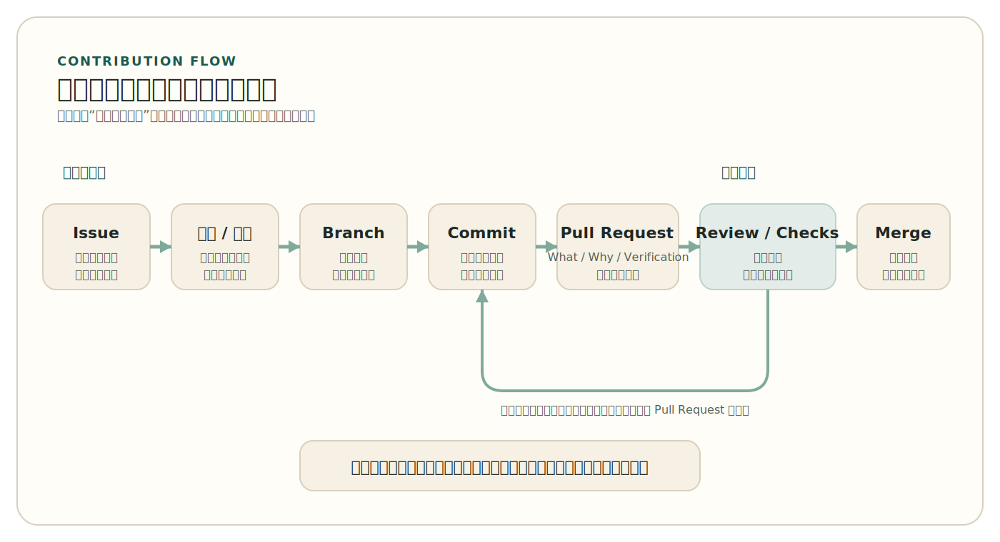

# 第 6 章 参与开源项目

能够阅读和评估项目，并不自动等于能够参与项目。很多人第一次接近开源贡献时，会把困难想象成“技术还不够强”，仿佛只要再多学一些框架、算法或架构知识，就自然能迈过门槛。真正靠近一次真实贡献时，困难却往往出现在别的地方：项目需要什么、哪些修改应该先讨论、Pull Request 为什么要写清楚范围、review 为什么会要求返工、为什么一个看起来很小的修改也可能因为边界不清而被拒绝。

这正是第 6 章要回答的问题。前一章已经讨论过，读者面对陌生仓库时，应怎样从许可证、治理信号、工程对象和发布记录中形成项目判断。本章则沿着这条线继续推进：当读者已经大致知道一个项目在做什么、处在什么状态、自己下一步准备做什么时，第一次真正的参与应当如何开始？换句话说，本章讨论的不是“怎样尽快提交代码”，而是怎样把一次修改组织成项目能够理解、评审和接受的贡献对象。

第 5 章把项目阅读的终点收束为几种行动选择：继续学习、尝试贡献、复用、先观察、暂时放弃。本章的起点，就是那些经过第一轮判断后，决定进入“尝试贡献”的读者。也正因为如此，这里不再讨论“这个仓库值不值得继续看”，而是讨论当行动已经被选定之后，第一次贡献应如何被组织。

从维护者视角看，参与开源并不是“谁把代码写出来谁就赢了”，而是在已有维护责任和项目边界之内提出一个公共建议。只要理解了这一点，许多常见误解就会自动收紧：第一次贡献未必从新功能开始；代码写完也不代表修改已经成立；review 不是附加阻碍，而是协作继续发生的地方；一次成功合并也不等于参与已经自然稳定下来。开源贡献真正考验的，往往不是个人爆发力，而是能否把自己的工作变得可解释、可协商、可合并。

## 1. 参与从尊重项目边界开始

第 5 章中的项目阅读，到这里要转成一个更窄的问题：不是“这个项目总体上怎么样”，而是“这一次修改是否值得现在进入”。这一步看起来更小，实际却更难，因为它要求贡献者把项目级判断压缩成一次具体行动。项目可以总体上很健康，但某项特定修改仍可能不适合当前版本周期；项目也可以总体上值得关注，但某个旧问题却可能早已脱离当前方向。这就是本节要讨论的：怎样为一次具体修改确认项目边界。

第一次参与开源时，最重要的判断不是“我想改什么”，而是“这个项目现在需要什么”。这句话听起来像常识，但真正做起来并不轻松。一个项目也许确实有缺陷，也许确实有可以改进的地方，但维护者未必希望在当前版本周期里处理这件事，也未必愿意为此承担额外维护成本。对贡献者来说，先理解项目边界，不是向维护者“请示”，而是为了确认自己的工作是否真的会落进项目当前节奏之中。

这里的“项目边界”并不神秘，它通常已经留在公开对象里。README 会说明项目的定位，`CONTRIBUTING.md` 会说明希望怎样进入，Issue 讨论会暴露维护者正在关注什么，版本计划和发布节奏会提示哪些改动现在值得做、哪些更适合稍后再谈。成熟项目当然未必把所有判断都写得一清二楚，但只要读者认真看过这些对象，通常都能得到至少几个重要信号：这是一个更欢迎小修复的项目，还是正在进行大范围重构的项目；这是一个对外部贡献响应稳定的项目，还是主要依赖少数人低频维护的项目；这是一个愿意先在 Issue 中对齐范围的项目，还是一个对边界已经有很多历史判断的项目。

也正因为如此，第一次贡献之前最需要做的，不是重新做一遍第 5 章式的全面项目诊断，而是为“这一次修改”确认几件更具体的事情。至少包括：

- 这个问题是否已经被报告，或者是否已经有人在处理
- 这项修改是否真的落在项目当前范围内
- 这个版本阶段是否适合接收这类修改
- 项目是否明确要求先开 Issue、先讨论设计，或者先认领任务

一个经常被低估的情况，是“问题确实存在，但项目当前并不想这样解决”。以安装说明遗漏 `DATA_DIR` 环境变量为例，同一个问题就可能落入两种完全不同的判断。情况 A 是：维护者已经在公开讨论里说明，下一个版本会整体重写安装文档。那么此时“马上补一句说明”虽然能解决眼前问题，却可能和即将到来的整体调整冲突，反而增加重复劳动。情况 B 是：讨论里没有任何文档重写计划，这个遗漏已经真实阻塞了第一次本地运行，而且修改范围可以明确收敛在 quickstart 部分。只有在情况 B 里，它才更像一次适合作为第一步的贡献对象。

这也是为什么第一次贡献不能只看“我会不会改”，还要看“项目此刻愿不愿这样改”。一个旧 Issue 看起来无人处理，不代表它仍然有效；一个标签看起来像在邀请贡献，也不代表上下文没有变化；一个问题看起来只需要改一行文档，也不代表维护者想在当前阶段用这种方式解决。第一次参与最容易犯的错误之一，就是把“我能修”误看成“项目现在就需要这样修”。

更具体地说，判断一个问题是否仍然活跃，通常可以顺着公开记录看三层信号。第一层是时间：最近一次维护者评论发生在什么时候，最近一次相关提交或 Pull Request 又发生在什么时候；如果一个标签挂了两年却长期没有任何回应，这往往说明上下文已经漂移。第二层是关联对象：Issue 是否已经连到了正在进行的 Pull Request、milestone、项目看板或后续讨论；如果这些关联对象已经关闭、过期或方向明显变化，那么原问题即使还开着，也未必适合继续按原思路推进。第三层是判断语气：维护者最近是在继续收敛解决方案，还是已经明确表示“暂不处理”“等待更大重构”或“欢迎但需要先讨论设计”。只要把这三层信号连起来看，读者通常就能比只看“open / closed”状态得到更可靠的结论。

因此，大改之前先问，往往比先做完再说更稳妥。对于边界清楚的小问题，提一个认领评论、说明自己准备如何处理，通常就足够了；对于范围较大的功能、重构或接口调整，则更应先在公开记录里对齐。真正成熟的贡献者，总会先把自己放回项目已有节奏里，而不是绕开这个节奏直接提交结果。对项目来说，这是一种尊重；对贡献者来说，这也是节省自己时间和精力的办法。

> 提示
> 第一次参与时，最值得追求的不是“尽快做出修改”，而是“尽快确认这项修改值得做、适合现在做、适合由我来做”。

## 2. 第一次贡献做什么

第一次贡献未必要从新功能开始。对多数项目而言，更常见也更稳妥的入口包括文档修订、安装说明补充、测试完善、小型缺陷修复、样例更新、复现步骤澄清和问题分诊。这些工作之所以适合作为起点，不是因为它们“低级”，而是因为它们最容易帮助贡献者接触项目的真实语言、结构和评审标准。一个人只要能把一次小修改做清楚，就已经在学习怎样与真实维护流程协作。

更重要的是，这类任务通常边界更清楚，也更容易验证。一份文档修订是否准确，可以回到项目事实核查；一个测试补充是否成立，可以通过自动化结果验证；一个小型缺陷修复是否有价值，也往往可以围绕已有 Issue、复现路径和回归条件来说明。对第一次贡献而言，这种“边界清楚、验证明确、影响可控”的特征，比任务看起来是否“酷”更重要。项目之所以更容易接受这类修改，不是因为维护者不重视核心功能，而是因为他们能更快判断这些工作是否值得进入主线。

第一次贡献是否合适，与其靠直觉，不如按任务类型去判断。表 6-1 给出了一张更实用的检查表。

<!-- figure-id: ch06-tab-01-first-contribution-types | core | status: final | source-trail: chapter 6 section 2 narrative; contribution type classification; fully redrawn -->
<p class="book-table-caption">表 6-1 第一次贡献的任务类型与判断方法</p>

| 任务类型 | 为什么常适合作为第一步 | 进入前要确认什么 | 暂不适合的信号 |
| --- | --- | --- | --- |
| 文档修订、安装说明补充 | 修改位置明确，容易回到事实核查，便于快速理解项目语言 | 问题是否仍然存在；相关文档是否正准备整体重写；是否能重跑一次步骤验证 | 文档体系正在整体改版，或修改会牵连大量无关内容 |
| 测试补充、样例更新 | 验证路径清楚，容易与自动化结果对应 | 是否已有复现路径；项目是否接受 test-only PR；修改是否只覆盖一个清楚问题 | 需要先理解复杂测试框架，或测试范围会牵动多个子系统 |
| 小型缺陷修复 | 外部影响清楚，容易围绕现象、原因和回归条件组织说明 | 是否已有 Issue；影响范围能否隔离；是否存在明确的回归验证方法 | 改动横跨多个模块、涉及接口设计或长期兼容性 |
| 问题分诊、复现步骤整理 | 能直接降低维护者成本，也帮助后来者进入问题上下文 | 仓库是否鼓励这样做；复现环境是否可获得；已有讨论是否需要补证据 | 项目长期无响应，或问题本身已明显脱离当前版本周期 |
| AI 项目的模型卡、评测说明、部署脚本补充 | 边界通常清楚，且对复现与再使用有直接帮助 | 缺失信息是否能被核查；修改是否只涉及公开对象；是否能重做相关评测或运行路径 | 需要重新训练模型、重写数据管线，或牵涉无法验证的来源与合规问题 |

很多项目也会用标签给外部贡献者提供一些弱提示，例如 `good first issue` 或 `help wanted`。这些标签很有价值，因为它们能帮助后来者缩小搜索范围；但它们不是保证书。一个被标成 `good first issue` 的问题，也仍然可能因为讨论已过时、上下文有变化、版本节奏改变或者维护者当前精力不足，而不再适合作为第一步。更稳妥的做法，是把标签视为入口信号，而不是直接把它当作执行命令。看见标签之后，仍然要回到问题讨论、维护状态和贡献指南里再做一次确认。

把标签再往前核查一步，通常至少要确认四件事：

- 这个问题最近是否仍有维护者回应，而不是停留在很久以前的旧讨论
- 问题描述是否足够清楚，能够知道影响范围和预期结果
- 相关文件或目录是否相对集中，不必第一次就跨越太多子系统
- 贡献指南是否给出了对应进入路径，例如先认领、先讨论，或直接发起 PR

这些核查点之所以重要，在于标签本身只是一种弱信号，而不是维护承诺。比如，一个 `good first issue` 如果创建于很久以前、此后几乎没有回应，往往说明它只是历史上某个时点对外留下的入口，并不代表今天仍然适合作为第一次尝试。再比如，问题描述如果只留下“这里有 bug”而没有复现条件、影响范围和预期行为，那么即使贴了友好标签，第一次贡献者也很容易在实现过程中不断猜测上下文。真正稳妥的做法，是把标签当作缩小搜索范围的起点，再用讨论记录和项目现状去验证它是否仍然成立。

为了让这个判断更具体，不妨沿着上一节的情况 B 继续往前走。假设某项目的安装说明遗漏了 `DATA_DIR` 环境变量设置，导致外部人按 README 操作后无法在本地跑通；维护者也没有宣布重写整套文档，相关 Issue 仍在当前版本周期里活跃。对第一次贡献者来说，这类问题通常就是理想入口：它有清楚的外部影响，有明确的修改位置，有相对清楚的验证方式，也能帮助贡献者快速理解项目在文档、提交流程和 review 中究竟重视什么。一个看起来并不“宏大”的文档修订，往往比贸然增加一个没人要求的新功能，更能让贡献者真正进入项目。

如果参与对象是一个 AI 项目，这条路径也并不会突然变成“先去训练一个模型”。很多更现实的入口恰恰仍然是边界清楚、可被验证的工作，例如补充模型卡和数据说明、整理评测文档、修正复现步骤、改进推理或部署脚本、补充 benchmark、澄清许可证与来源信息。这些工作未必比写核心代码更轻松，但它们更符合真实 AI 项目的维护需要，也更适合作为第一次进入时的公共贡献对象。也正因为如此，本章虽然会轻量提到 AI 项目的特殊性，但并不会把 AI 项目的参与路径写成另一套完全不同的流程。贡献路径的基本结构没有变，变化的是项目对象和验证重点。

例如，一个公开发布权重和推理脚本的 AI 项目，如果 quickstart 已经能够启动，但模型卡没有写清楚显存前提、量化版本差异和已知限制，那么第一次贡献更适合作为模型卡与评测说明补充；相反，如果问题指向训练数据管线重组、权重转换格式重写或整套 benchmark 重建，它就已经超出了第一次进入时更稳妥的边界。

第一次贡献同样有一些不太适合立即选择的对象。大范围重构、没有明确需求支撑的新功能、横跨多个子系统的改动、需要长期路线协调的设计调整，通常都不适合作为第一步。问题不在于新人“没资格”做这些事，而在于这类工作更依赖长期上下文，也更容易在 review 中不断暴露新的边界条件。第一次贡献真正要学会的，不是一次做很多，而是一次把一件事做完整。只要能把一个小而清楚的问题处理好，后面的路就会自然打开。

## 3. 把修改组织成贡献对象

一项修改之所以能被项目接受，并不只取决于代码本身，也取决于它如何被说明。Issue 用来界定问题，分支（`Branch`）用来隔离修改，提交（`Commit`）用来记录历史边界，Pull Request 则把这些内容重新组织成一个公共判断对象。对维护者来说，一次贡献是否值得处理，很大程度上取决于它是否清楚说明：解决什么问题，为什么这样修改，影响范围在哪里，还需要注意哪些兼容性或测试条件。

从贡献者动作看，这条路径通常会被组织成图 6-1 所示的最小流程：先确认问题和范围，再隔离修改、留下历史、提交 Pull Request、经过 review 与检查，最后才进入合并。

<!-- figure-id: ch06-fig-01-contribution-flow | core | status: final | source-trail: chapter 6 sections 3-4 narrative; contribution path from issue to merge; fully redrawn -->
<figure class="book-figure">
  
  <figcaption>图 6-1 从问题到合并的最小贡献流程</figcaption>
</figure>

这也是为什么很多修改即使“技术上能工作”，仍然会被要求返工。项目不是在评估一段孤立代码，而是在评估这组修改是否能被主线稳定吸收。一个把多个无关问题混在一起的 Pull Request，会让评审者很难判断范围；一个没有说明验证方式的 Pull Request，即使差异很小，也会让维护者难以确认它是否真的解决了问题。

在真实协作里，这种“包装”通常从很早就开始了。对范围不大的问题，贡献者往往会先在原 Issue 里留下一句认领说明，告诉维护者自己准备如何处理。例如：

```text
If this is still useful, I’d like to work on it.
I plan to update the setup docs and verify the local quickstart steps.
```

这样做的价值，不是礼貌，而是让项目知道这项修改已经有人接手，也让后续 Pull Request 的来路更清楚。对于更复杂的工作，贡献者甚至可以更早打开草稿 Pull Request（draft PR），先让维护者看到修改方向，而不是等到实现全部完成后才一次性交付结果。一个贡献越早被放进公共记录，项目就越容易在成本还低的时候纠偏。

如果原 Issue 里已经确认没有整套文档重写计划，这条认领评论就等于把上一节的情况 B 正式放进公共记录。之后的实现边界也应跟着收紧：只改 quickstart 所需的说明，不顺手清理其他段落，不把无关格式调整和链接修订混进同一个修改里。贡献对象越清楚，后续评审成本就越低。

下一步通常是开一个独立分支，例如 `docs/fix-data-dir-quickstart`。对拥有直接写权限的人来说，这个分支可以建在主仓库；对外部贡献者来说，更常见的路径是先 `fork` 一份仓库（即在自己的帐户下创建一份独立副本），再在自己的副本里开分支并向上游项目发起 Pull Request。无论路径落在哪个托管细节上，核心原则都没有变化：修改必须先被隔离出来，才能让别人清楚判断它的边界。

第一次走 `fork-and-pull` 路径时，更稳妥的最小动作序列通常是：先 `fork`，再把自己的副本拉到本地，在本地创建专用分支完成修改，随后把分支推回自己的副本，最后从这个分支向上游仓库发起 Pull Request。对项目来说，这条路径的价值在于它既允许外部贡献者安全地准备修改，也不会要求维护者提前开放直接写权限。也正因为如此，很多第一次贡献实际上并不发生在“直接改主仓库”里，而是发生在“自己的副本 + 指向上游的 Pull Request”这一更常见的公共协作模式中。

分支之外，提交历史也需要承担说明责任。哪怕只改了文档，也应把提交信息写成一个能单独成立的最小判断单元。例如：

```text
docs: add DATA_DIR setup step to quickstart guide

The local quickstart currently fails for first-time users because
DATA_DIR is not mentioned in the setup instructions.

Closes #42
```

Pull Request 描述本身也应承担解释责任。对第一次贡献者来说，最稳妥的最小结构通常已经足够：

```text
## What
- clarify the missing DATA_DIR setup step

## Why
- local quickstart currently fails for first-time users

## Verification
- reran the quickstart from a clean local environment

## Not included
- no changes to deployment or production configuration
```

这样的说明之所以有用，不在于它像模板，而在于它把评审者最关心的四件事放到了台面上：改了什么、为什么改、怎么验证、故意没改什么。尤其最后一项常常很重要，因为维护者不仅关心修改做了什么，也关心它没有试图顺手再做哪些事。第一次贡献最容易失控的地方，往往不是实现错误，而是范围不断膨胀。

到这一步，修改还没有结束。若项目配置了 Markdown lint、docs build 或链接检查，这个 Pull Request 还需要先让这些自动化检查通过。对 `DATA_DIR` 这个例子来说，绿色检查并不只意味着格式正确，更意味着 quickstart 文档仍能被项目现有的文档流水线稳定吸收。第一次贡献者越早把“我改完了”转换成“项目的检查也通过了”，就越接近真实协作。

继续沿着前面的例子看，这条逻辑会更清楚。一个贡献者如果只是直接提交“README 修改了一行”，项目很难知道这是不是一次零散改动；但如果它能明确关联到“安装说明遗漏 `DATA_DIR` 导致 quickstart 失败”这个问题，并说明自己已经重跑过本地步骤，让提交历史、Pull Request 描述和检查结果彼此支持，那么这次修改就从“看起来改了一行文档”变成了“围绕一个真实使用问题给出的可验证修正”。这正是贡献对象和代码片段的区别。

## 4. Review 不是阻碍，而是协作的延续

第一次收到 review 时，很多人会本能地把它理解成否定，仿佛自己的工作被“挑错”了。真正成熟的开源项目里，review 更像是一段协作的延续：维护者通过评审把项目上下文、风格要求、边界判断和长期维护考虑重新传回修改者。也正因为如此，review 中出现的很多意见并不直接针对代码语法，而是针对范围控制、命名、兼容性、测试覆盖、文档完整性和未来维护成本。

从流程上说，现代平台通常会把 review 结果表达为几种稳定状态，例如 `comment`（评论性意见）、`approve`（同意合并）和 `request changes`（请求修改）。这些状态代表的不是情绪，而是项目在说：这里还有讨论空间；当前修改已经可以接受；或者这项修改暂时还不能进入主线。把这些状态理解清楚很重要，因为它能帮助贡献者意识到，review 并不是“给你打分”，而是在公共记录里说明这项修改距离可接受状态还有多远。

对贡献者而言，关键不是“让评审尽快结束”，而是学会回应评审。解释自己的选择，承认不清楚的地方，按意见拆分修改，必要时补充测试或文档，这些动作本身就是参与的一部分。很多第一次贡献之所以有价值，并不是因为第一次提交就完全正确，而是因为贡献者能够顺着 review 往前走，最终把修改调整到项目能够接受的形态。真正让维护者建立信任的，往往也不是“从不出错”，而是“收到反馈后能不能稳定地继续合作”。

这时最需要避免的，是把 review 变成私人防御。公共评审应尽量在公共线程里继续，解释为什么这样改、为什么同意拆分、为什么暂时不同意某个建议，都应尽量留在同一条记录中。这样后来的维护者和贡献者才能看见这次判断是如何形成的。如果每次遇到意见就转向私下沟通，项目的制度记忆就会迅速流失。对第一次贡献者来说，这一点尤其重要，因为 review 不只是修改代码，也是学习项目如何表达判断。

继续用前面的例子来看，review 很可能不会只说“文档这样写不对”。维护者也许会指出：说明文字还应补上 Windows 路径差异；与这次问题无关的格式整理请不要混进同一个 PR；本项目要求文档修改同时通过 docs build；标题里最好直接点出 quickstart 失败的原因。这些意见看起来像细节，但它们共同传回的是项目的工作方式。一个贡献者如果能顺着这些意见修改，再在原 PR 中解释自己做了什么，实际上已经开始学会和项目一起工作。

在 `DATA_DIR` 这个例子里，一个典型的评审线程可能像这样继续下去：

```text
Reviewer (request changes)
- Please mention the Windows path variant as well.
- The docs build is green, but the PR title should say this fixes quickstart failure.
- Please remove the unrelated formatting change in config.md.

Contributor
- Updated the PR title to clarify the quickstart failure.
- Added a short Windows note next to the DATA_DIR example.
- Removed the unrelated formatting change so this PR stays focused on #42.
```

这里真正重要的，不是“回复得像不像模板”，而是修改是否继续沿着同一条公共记录推进。贡献者会把后续提交继续推到同一分支上，让 Pull Request 自动更新；维护者则能在原来的上下文里重新看差异、重新看检查结果，而不必把判断拆散到多个线程里。更具体地说，只要维护者没有明确要求拆成另一条 Pull Request，贡献者通常就应直接在同一分支上继续提交并 `push`，平台上的原 PR 会自动纳入这些更新。对第一次贡献者来说，这种“在同一条 PR 里把事情做完”的能力，比第一次提交就完全正确更重要。

当后续提交把问题修正到位、必需检查再次通过，而评审者给出 `approve` 时，这次修改才真正接近合并。如果 Pull Request 描述里已经用 `Closes #42` 之类的语句关联了原 Issue，那么 merge 之后，问题记录也会跟着一起收束。这样，一次从发现问题、认领、提交、检查、评审到合并的完整闭环才算真正成立。

还有一种常见情况值得提前说明：项目并不总是立即响应。维护者可能精力有限，也可能只在固定节奏里集中处理贡献。遇到这种情况，更成熟的做法不是立刻另开一个新的 Pull Request，也不是转去私聊催促，而是在合理间隔后在原线程里做一次简洁跟进，确认这项修改是否仍然值得继续推进。开源参与需要技术能力，也需要协作耐心。学会在公共记录中等待、跟进和收束，本身就是参与能力的一部分。

> 注意
> 第一次贡献最值得学习的，不是“怎样让自己的第一版看起来完美”，而是“怎样让项目愿意继续和你把这件事做完”。

## 5. 从一次贡献走向持续参与

真正的开源参与，不会停留在“一次合并成功”的瞬间。一次贡献之后，读者会逐步发现，项目真正需要的往往不是偶然出现的热情，而是能够持续理解上下文、持续处理问题、持续承担责任的人。持续参与并不意味着立刻成为维护者，而是意味着开始形成稳定关系：知道哪些问题值得继续跟进，知道哪些讨论需要长期观察，也知道自己在项目中的可信度是如何逐步建立起来的。

第 3 章已经把开源社区中的角色理解为一种梯度结构：使用者、贡献者、维护者并不是彼此隔绝的身份，而是沿着责任逐步移动的位置。第 6 章在更具体的贡献路径上看到的，正是这个梯度如何在公共记录里慢慢发生。一个人先把文档修订做清楚，再把问题复现做扎实，再逐步帮助别人收束讨论和补验证，这条路径本身就是角色变化的证据。

这种关系的建立，通常并不依赖某一次“特别厉害”的提交，而依赖一组重复出现的信号：贡献者选择的任务边界是否清楚，PR 描述是否让人容易评审，收到 review 后是否愿意继续协作，合并之后是否还会关心问题是否真正解决，项目暂时不采纳时是否仍然能保持公共沟通的节奏。可信度不是靠自我介绍建立的，而是靠公共记录慢慢累积出来的。

这也解释了为什么“一次贡献未被接受”并不自动等于参与失败。项目也许会因为版本节奏、方向判断、已有实现或维护成本考虑而拒绝某个修改。只要这个过程发生在清楚、公开、可回看的记录里，贡献者仍然是在学习项目如何做判断。很多真正长期参与的人，并不是第一次就被无条件接受，而是在几次尝试里逐渐理解了项目的边界、语气和节奏，随后才找到更稳定的进入方式。

如果第一次贡献确实被拒绝，更稳妥的下一步通常不是立刻换个说法重新提交同一件事，而是先回看拒绝理由到底落在哪一层：是版本节奏不对，还是项目方向不接受这种方案，或者只是这项修改需要更小的切分方式。只有把这个判断读清楚，读者才知道下一步应当是等待更合适的版本窗口、寻找另一个更贴合当前节奏的问题，还是先继续观察项目如何处理类似修改。一次被拒绝的记录，只要读得认真，往往也能反过来帮助贡献者更快找到真正可进入的位置。

持续参与的路径也不只有“继续提代码”这一条。一个人可能先从修文档开始，后来逐步帮助复现问题、补测试、整理使用者常见困惑、回答一部分讨论、帮助 triage Issue，甚至在自己对上下文足够熟悉之后，开始评审别人的小修改。角色的变化不是通过一次授权瞬间完成的，而是在越来越多公共责任被稳定承担之后，慢慢发生的。开源项目之所以能够长期运行，正是因为有人沿着这条路径，从一次具体修改逐步走进更稳定的责任结构。

对第一次贡献者来说，更现实的目标因此不应是“立刻成为项目核心”，而应是把第一次参与变成一条可继续往前走的线。只要这次贡献能让项目更容易理解你、也让你更容易理解项目，那么它就已经具备了超出一次提交本身的价值。继续沿着这条线走下去，读者迟早会发现：真正的开源参与，并不是不断向项目索取“我能不能做这个”，而是逐步让项目相信“这件事可以交给我继续往前推”。

这条路径对后续使用 AI 辅助开发同样成立。即使某次文档、测试或代码草稿主要由 AI 生成，项目也不会因为产出更快就绕过本章讨论的边界确认、Pull Request 说明、review 回应和检查门禁。AI 只会改变候选内容生成的速度，不会取消贡献对象必须被解释、验证和合并的要求。

## 本章小结

参与开源项目，不是把代码提交到公开仓库这么简单，而是在已有治理和维护责任之内，提出一个能够被理解、被评审、被接受的修改建议。项目边界、任务选择、贡献说明、Pull Request 组织和 review 回复，都是第一次贡献能否成立的关键条件。真正有效的第一次参与，通常不是“做了很多”，而是“把一件事做清楚，并让项目愿意继续和你协作”。

一旦读者理解了这一点，就会知道第一次贡献真正锻炼的不是“写出更多代码”，而是学会在公共协作中提出合适的修改，并顺着评审把它打磨到可合并状态。下一章将在这一基础上进一步讨论：当 AI 进入软件开发之后，这条贡献路径会发生什么变化，又有哪些责任并不会因此消失。

## 延伸阅读

- Open Source Guides, “How to Contribute to Open Source”
- GitHub Docs, “About pull requests”
- GitHub Docs, “About pull request reviews”
- GitHub Docs, “Contributing to projects”
- GitHub Docs, “Managing labels”
- tldr-pages/tldr, "CONTRIBUTING.md"
- Contributor Covenant, "A Code of Conduct for Open Source Communities"
- Karl Fogel, *Producing Open Source Software*
