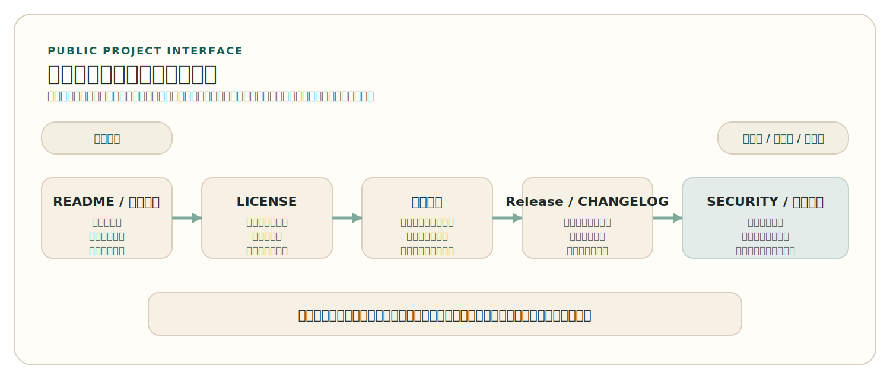

# 第 8 章 组织与发布你的开源项目

很多仓库虽然公开可见，却还不是一个真正可参与、可维护、可发布的开源项目。它们可能已经有代码，也可能已经能运行，但对外部人来说，项目仍然像一个私有开发现场：目标不清楚，安装方式不明确，贡献入口缺失，版本边界模糊，出了问题也不知道应当联系谁。开源项目的“公开”，并不等于把代码放到互联网上，而是要让陌生的使用者、贡献者和后续维护者都能看懂项目在做什么、如何使用、怎样参与，以及项目准备怎样继续存在。

这也是本章的出发点。前几章大多从读者、贡献者或协作者视角展开，说明如何理解项目、进入项目、参与项目，以及如何在 AI 环境下保持工程纪律。本章则切换到创建者和维护者视角，讨论怎样把一个项目组织成真正面向公开协作的对象。问题不再是“别人项目里的 README、LICENSE、Pull Request 和 Release 为什么重要”，而是“如果项目是由你来维护，这些对象应当如何被设计、发布和持续更新”。

维护者视角真正关心的，也不是“把仓库包装得更像一个正式项目”，而是“怎样降低外部进入的不确定性”。一个读者第一次打开仓库时最先关心的问题通常非常朴素：这个项目解决什么问题，是否还在维护，如何开始，遇到问题怎么办，哪些边界已经稳定，哪些地方仍在变化。只要这些问题还说不清楚，项目就很难真正进入公共世界。相反，一旦这些问题被持续、清楚地组织出来，项目就算规模不大，也已经开始具备现代开源工程的基本形状。

## 1. 公开仓库不等于可公开参与的项目

“仓库已经公开”只说明一件事：别人可以看到代码。它并不自动说明这个项目能否被理解、被使用、被参与或被持续维护。很多个人实验仓库、阶段性团队仓库甚至公司内部镜像仓库都会公开可见，但外部人第一次进入时仍然会很快陷入不确定：不知道项目是否仍在维护，不知道它适合谁，不知道安装路径是否还有效，不知道该从哪里报告问题，也不知道当前默认分支到底代表稳定状态、实验状态，还是作者随手上传的最新工作区。

一个典型场景是：仓库里已经有持续集成配置、几十次提交和一份写着“Quick Start”的 README，看上去像个完整项目；但它没有版本标签，不说明当前分支是否稳定，Issue 区长期无人回应，也没有任何贡献说明。外部人当然可以克隆代码，却很难判断自己是否值得继续投入时间，更不知道自己的提问和修改会不会被接住。这类仓库在可见性上是公开的，在参与性上却仍然是封闭的。

因此，维护者设计项目的第一步，不是继续往仓库里堆文件，而是先承认一个事实：外部人并不知道你已经知道的那些背景。你知道为什么目录这样划分，知道哪个脚本只是临时工具，知道当前版本还不适合广泛使用，也知道团队内部默认如何分工；但这些知识如果没有被重新写成公共对象，对外部人来说它们就仍然不存在。开源项目真正的“公开”，首先是把这种隐含知识显式化。

这也是为什么真正能被外部人进入的项目，往往会形成一层稳定的公共界面。它并不是图形界面意义上的 UI，而是外部人第一次接触项目时所依赖的一组说明与入口：README、许可证、贡献说明、版本与发布记录、问题报告路径、安全说明、维护状态等。平台之所以会自动展示 README、贡献指南或安全策略，背后正是在承认这些文件承担的不是装饰作用，而是理解和参与项目的入口作用。

把这层公共界面拆开来看，最关键的是下面几类对象。

<!-- figure-id: ch08-tab-01-public-project-interface | core | status: final | source-trail: chapter 8 sections 1-2 narrative; official repository health and release documentation; fully rewritten -->
<p class="book-table-caption">表 8-1 项目公共界面的关键对象与它们解决的不确定性</p>

| 关键对象 | 外部人最先关心的问题 | 维护者需要明确什么 |
| --- | --- | --- |
| README / 项目主页 | 这个项目到底在做什么，我为什么要继续看下去 | 项目定位、适用对象、当前状态、最小使用路径 |
| LICENSE | 我能否合法使用、修改和再发布它 | 制度边界、限制条件、署名或传染要求 |
| `CONTRIBUTING.md` / 支持入口 | 如果我想提问题或提交修改，应当从哪里开始 | 贡献方式、先读什么、哪些修改适合先做、哪些问题应先讨论 |
| 版本、Release、`CHANGELOG` | 当前哪些内容稳定，升级风险在哪里 | 版本边界、已发布内容、兼容性变化、关键变更 |
| `SECURITY.md` / 维护说明 | 发现问题后找谁、哪些版本仍被支持 | 漏洞报告路径、支持版本、维护责任与响应方式 |

如果把这些对象再按外部人进入项目时最常经历的顺序组织起来，就会得到一条更清楚的公共入口层。

<!-- figure-id: ch08-fig-01-public-participation-path | core | status: final | source-trail: chapter 8 sections 1-2 narrative; public interface objects ordered by external entry flow; fully redrawn -->
<figure class="book-figure">
  
  <figcaption>图 8-1 从公开仓库到可公开参与项目的公共入口层</figcaption>
</figure>

这个表真正要强调的不是“这些文件都要有”，而是“这些不确定性都必须被处理”。有些项目规模很小，未必一开始就需要把所有对象写得很长；但只要它希望被别人真正使用和参与，就至少要让外部人不至于在最基本的问题上迷路。一个看起来“文件很全”却仍然说不清项目边界的仓库，依旧不是成熟的公开项目。反过来，一个文件不多、但每个关键不确定性都被清楚回答的项目，往往更容易被信任。

维护者还需要知道，公共界面不是一次性施工，而是项目演化的一部分。README 写完一次并不意味着以后不需要改；版本稳定后，安装方式可能变化；项目不再积极接受某类贡献时，贡献说明也应及时调整；如果某一条支持渠道已经不再使用，就不应继续让它挂在入口处制造误导。公共界面之所以属于工程，而不是文案包装，正因为它必须和项目真实状态保持一致。

因此，本章后面讨论的 README、版本、发布、维护计划和安全基线，不应被读成分散的仓库规范，而应被看成同一件事的不同表现：维护者怎样把项目组织成可被陌生人理解和信任的公共对象。

> 注
> 代码公开解决的是“别人能看到什么”，公共界面解决的是“别人能不能理解、使用并继续参与什么”。

## 2. 从维护者视角设计项目入口

维护者设计项目入口时，最容易犯的错误，是把“自己已经知道的内容”误当成“外部人也能自然推断出来的内容”。README 不应只是功能点罗列，它要把项目定位、当前状态、最短上手路径、后续参与入口和求助路径一次说清。Open Source Guides 长期强调，项目入口至少应让别人理解用途、上手方式、贡献方式和获取帮助的路径；这背后的逻辑其实非常稳定，因为外部人第一次进入项目时最先关心的往往就是这些问题。

从维护者角度看，一份真正承担入口职责的 README，通常至少要完成几件事。第一，它要说明项目定位，而不是只展示作者觉得重要的功能点。第二，它要告诉别人如何开始，而不是把安装和运行过程留在作者脑中。第三，它要交代当前状态，例如是否仍在积极维护、是否仍属实验阶段、是否已经有稳定发布。第四，它要把后续入口导向其他公共对象，例如贡献说明、版本记录、文档首页、讨论或支持路径。README 的任务不是把所有细节都写在首页，而是把陌生人稳妥地送到下一步。

一个面向公共世界的最小入口结构，往往可以先按下面这种顺序来理解：

```text
项目是什么
项目当前状态如何
最短上手路径是什么
制度边界是什么
如果要继续参与，应去哪里
如果遇到问题，应找什么入口
```

如果把这组抽象标题进一步落成更接近真实仓库首页的最小片段，通常会更像下面这样：

````md
# Example Project

一套帮助小团队管理协作项目发布与维护基线的工具。

当前状态：`v0.x`，仍在快速迭代，不承诺完整稳定接口。

## Quick Start

```bash
make setup
make run
```

## Contributing

第一次参与前请先阅读 `CONTRIBUTING.md`。

## License

MIT
````

这个片段当然远远不是完整 README，但它已经完成了几件非常关键的事：告诉外部人项目是什么、当前稳定到什么程度、怎样开始、下一步去哪里看，以及制度边界是什么。维护者真正需要掌握的，正是这种“把隐含背景压缩成外部人可立即使用的入口”的能力。

真正重要的不是这几行标题长什么样，而是维护者是否已经把这些信息显式化。很多项目的问题并不是没有 README，而是 README 只写了“这个项目很酷”“它支持很多功能”，却没有告诉外部人当前到底适不适合继续投入。一个维护者如果知道项目还不稳定、安装方式刚变化、接口还在重构，最负责的做法不是把这些信息藏起来，而是直接写出来。说清楚“不稳定”“实验性”“暂不接受某类贡献”，往往比留下模糊乐观表述更能建立信任。

反过来看，如果 README 只写“这是一个很酷的项目”“支持许多功能”，却把安装方式、当前状态和贡献入口都留给读者自己去猜，那么首页虽然存在，入口职责却并未真正建立。外部人接下来只能翻目录、读脚本、看提交记录，甚至通过失败的安装尝试来反推项目边界。这样的 README 不是在降低不确定性，而是在把不确定性重新分配给后来者。

LICENSE 也是同样的道理。许可证文件当然是制度边界本身，但维护者真正要做的不只是把某份文本放进仓库，还要让外部人意识到这份文本在回答什么问题。别人是否能把这个项目嵌入自己的产品、是否能闭源分发修改版、是否必须保留相同许可证，都会直接影响采用判断。第二章已经解释了这些制度差异；到了维护者视角，更重要的问题变成了：你是否知道自己的项目准备向外提供什么制度边界，以及是否把这层边界明确地公开出来。

`CONTRIBUTING.md`、行为准则（`CODE_OF_CONDUCT.md`）、支持说明（如 `SUPPORT.md`）和 Issue / Pull Request 模板，则进一步把“如何参与”从一句口号变成实际入口。很多项目都会写“欢迎贡献”，但真正对外人有帮助的，是告诉他从哪里开始、哪些任务更适合作为第一次参与、什么问题应先讨论、提交前应准备什么、沟通发生在哪里。平台之所以会自动发现并展示这些社区健康文件，正因为它们已经成为现代开源项目公共界面的一部分。

这一层在今天尤其重要，因为项目不再只面对会读源代码的人。真实世界中的外部进入者可能是使用者、贡献者、下游维护者、文档翻译者，甚至是准备评估这个仓库能否长期采用的组织。维护者要做的不是揣测所有人的全部需求，而是先把最基本的公共路径搭起来，让不同类型的人至少能找到自己的第一步。

当项目本身包含 AI 相关部分时，入口设计还要再多一层说明责任。一个 AI 项目如果公开了代码、参数下载链接或演示页面，维护者就不应让外部人自己猜测这些对象之间是什么关系。更稳妥的做法是直接写清：哪些对象已经公开，哪些对象仍受限，项目当前更接近开放权重（`Open Weights`）、完整的开源人工智能（`Open Source AI`），还是一般开放发布对象；哪些评测、数据说明、已知限制与安全边界需要同时阅读。第 7 章强调了“AI 作为工具进入开源流程”和“AI 项目本身作为对象被判断”这两条线不能混淆；到了第 8 章，维护者要做的正是主动把这种边界写清楚，而不是把判断负担全留给外部人。

维护者还应认识到，项目入口设计并不是“项目做完后再补文档”。很多真正影响项目能否持续存在的问题，最早恰恰发生在入口层：别人第一次安装失败、第一次提问无门、第一次贡献不知道从何开始、第一次评估时看不清版本状态。入口写得越晚，项目越容易在这些最基础的地方反复返工。也正因为如此，项目入口应被看作维护工作本身，而不是开发收尾。

## 3. 版本、发布与对外承诺

项目一旦开始被外部人使用，版本和发布就不再只是内部打标签的动作，而是面向外部世界给出承诺。版本号告诉使用者边界发生了什么变化，Release 页面告诉他们这次更新包含什么内容，`CHANGELOG` 帮助他们判断是否需要升级，安装与使用文档则决定他们能否把项目真正跑起来。一个长期只在默认分支上前进、却缺乏清楚版本边界的项目，很难被外部稳定复用，因为别人无法判断“现在看到的仓库状态”与“上次稳定可用状态”之间究竟是什么关系。

这也是为什么维护者要区分至少三类对象：版本号、发布对象和发布说明。版本号回答的是“这次变化应当如何被理解”；发布对象回答的是“这次到底交付了哪些可安装、可下载、可复用的内容”；发布说明与 `CHANGELOG` 回答的则是“外部人应当怎样理解这次变化的范围、风险和重要性”。如果这三者之间缺少对应关系，外部人就只能去阅读默认分支、提交历史和零散讨论，自行猜测哪一版值得采用。这对任何希望被持续使用的项目来说，都是过高的认知成本。

语义化版本（`Semantic Versioning`）之所以长期重要，并不是因为软件世界缺少一种给版本号命名的方法，而是因为它把版本号重新解释成公共承诺。SemVer 的核心判断其实可以压缩为几句很稳定的话：版本号不应只是递增编号，而应表达公开边界的变化；主版本（major）通常对应不向后兼容的变化，次版本（minor）通常对应向后兼容的新功能，修订版本（patch）通常更接近向后兼容的问题修复；仍处于早期快速变化阶段的项目可以用 `0.y.z` 明确提示外部人边界尚未稳定；一旦某个版本已经对外发布，这个版本代表的内容就不应被悄悄修改，而应通过新的版本发布来修正。外部人之所以愿意依赖一个版本号，前提正是这个版本号代表的交付边界不会在背后漂移。

<div class="history-story">
  <p class="history-story-label">历史片段</p>
  <p>2010 年，Tom Preston-Werner 在 Semantic Versioning 规范里先写下的，并不是版本号的三段式语法，而是 <code>dependency hell</code>。这个词后来几乎成了软件工程里的常见表达，但它之所以重要，不在于描述“依赖很多”这件事，而在于点破了一个长期存在的问题：如果版本号不能清楚告诉别人兼容性边界，那么下游使用者就只能在升级时反复猜测风险。Preston-Werner 当然也因 GitHub 联合创始人的身份而广为人知，但在本章的语境里，他更重要的角色是把版本号重新写成了一种对外承诺。版本管理从此不只是“作者自己知道改了很多”，而是“别人也能判断这一版值得不值得升级、会不会破坏现有使用方式”。</p>
  <p>这也是语义化版本真正经受住时间考验的原因。它不是发明了计数方法，而是提醒维护者：一旦项目开始被别人依赖，版本号就不再属于你自己，而属于整个下游生态的预期管理。一个好的版本号因此不是排版整齐的数字，而是维护者对变化边界做出的公开表态。</p>
</div>

但版本号本身还不够。维护者还需要把“这次发布到底发生了什么”重新组织成外部人可读的形式。这正是 `CHANGELOG` 和发布说明的作用。像 Keep a Changelog 这样的长期约定之所以有价值，是因为它反复强调两件事：第一，变更记录是写给人读的，而不是把提交历史原样复制一遍；第二，值得记录的应当是关键变更（notable changes），也就是会影响使用者判断的变化，而不是所有微小内部动作。一个只有几十条提交、却没有清楚发布说明的项目，往往比一个提交更多、但发布记录清楚的项目更难采用。

因此，维护者写发布说明时应当把视角从“我最近改了很多东西”切到“外部人现在需要知道什么”。新增了什么、修复了什么、改变了什么、哪些变化可能影响兼容性、哪些问题仍然已知但未解决，这些信息才真正帮助别人决定是否升级。很多项目之所以长期难以被稳定复用，不是因为代码质量一定差，而是因为外部人无法从版本与说明中得到足够稳定的采用判断。

一个最小 `CHANGELOG` 条目，往往已经足以体现“写给人读”与“写给提交历史看”之间的差别：

```md
## [1.4.0] - 2026-04-09

### Changed
- require review before merge into the default branch

### Fixed
- ignore duplicate labels in issue triage
```

这段记录真正重要的，不是它是否完整覆盖了仓库里所有提交，而是它把使用者最关心的变化重新组织出来了。别人不必沿着几十条提交去猜本版边界，只要看这一条，就能先形成升级判断。

如果把这一层落到最小实践里，维护者至少要把三件事对应起来：

1. 版本号要表达兼容性或阶段边界，而不是纯粹递增。
2. 发布对象要与版本号一一对应，而不是只有主分支状态。
3. 发布说明要重新组织关键变更，而不是把提交日志扔给外部人自己消化。

如果再把它压成更接近 Release 页的最小发布说明，通常会像这样：

```text
## 1.4.0

### Changed
- review is now required before merge into the default branch

### Fixed
- duplicate issue labels no longer break triage scripts

### Compatibility note
- projects relying on direct merge to the default branch should update their workflow
```

GitHub 等平台提供 Release 页面和发布资产（assets），正是为了让维护者把“仓库历史中的某个状态”转化成“外部人可以下载、引用和理解的交付边界”。平台当然只是手段，但它提醒我们：发布不是把代码上传一次，而是把内部状态翻译成公共接口。

当发布对象不只是传统软件，而是一个 `AI system` 时，这种责任会进一步扩大。维护者不能只说“模型已经上传”或“权重可以下载”，还应说明支撑理解、修改和复现所需的 `Code`、`Parameters`、`Data Information`、评测方式与已知边界到底公开到了什么程度，哪些部分已经提供，哪些部分仍然缺失。也正因为如此，AI 项目的发布说明尤其不能把“开放得比较多”直接宣传成 `Open Source AI`。更负责任的做法，是把公开条件、许可证或访问条件、缺失项和使用边界一起写清楚，让外部人知道自己面对的到底是什么对象。入口层该怎样把这些对象摆给外部人，前面 §2 已经讨论过；这里更关注的是，维护者如何把相同的开放边界翻译成版本与发布承诺。

## 4. 维护计划与治理路径

一次发布不是项目的终点，而是维护工作真正开始的地方。Issue 会继续进入，文档会继续过时，依赖会继续变化，使用者会提出超出当前范围的请求，贡献者会带来新的可能性和新的维护成本。如果项目没有最小维护计划，它就很容易在第一次公开发布后迅速失速，因为它缺少处理这些后续压力的节奏与边界。维护计划未必要复杂，但至少应说明项目如何看待版本节奏、问题响应、贡献处理和后续演化方向。

这里最容易被误解的一点是：维护计划不等于宏大的路线图。对许多小型项目来说，更重要的往往不是承诺未来一年做什么，而是先回答几个近距离问题：哪些版本仍被支持，问题应该在哪里报告，维护者大致多久会看一次公开问题，哪些请求当前不在范围内，怎样判断一个贡献适合进入当前版本，项目如果暂时无人维护应如何对外说明。只要这些问题长期悬而未决，项目就算代码仍能运行，也很难被外部人稳定信任。

因此，维护者至少要让下面这几件事有明确归属：

- 谁负责分诊问题与讨论范围。
- 谁可以合并修改。
- 谁负责发布版本与更新发布说明。
- 哪些变化必须先讨论，哪些可以直接以 Pull Request 进入。
- 如果主要维护者暂时离开，项目如何保持最低连续性。

如果把这组要求压缩成一个极简维护计划片段，很多小项目其实只需要先做到这种程度：

```text
## Maintenance

- actively maintained by @author and @co-maintainer
- issues are triaged roughly once a week
- bug-fix PRs are reviewed within about 7 days; feature PRs may take longer
- v1.x is the supported release line; v0.x is no longer maintained
- if both maintainers become inactive, please open an issue to discuss project continuity
```

它当然不是复杂治理宪章，但已经把最关键的连续性问题说清楚了：谁在维护、节奏大致怎样、哪些版本还被支持、如果维护者退出会发生什么。对很多第一次准备公开发布的小型项目来说，这类五六行的维护说明，比空泛地写“欢迎大家一起维护”更真实也更有用。

治理路径也应从这一层开始理解。项目规模较小时，当然不必一开始就建立复杂的委员会或基金会式结构，但它至少要知道：角色和责任如何逐步扩展，后来者怎样从普通贡献者变成更稳定的协作者，哪些权限不能因为“大家都熟悉”就不写规则。Open Source Guides 在创建项目的检查清单里长期提醒维护者考虑管理连续性，例如让不止一人拥有项目管理能力；这背后的原则同样稳定，因为单点维护者风险（single point of failure）对小项目尤其现实。

如果项目最初来自一段阶段性的团队协作，这一层就更不能被忽略。协作进行时，团队成员通常默认彼此在线、彼此熟悉、彼此知道背景；一旦原始团队离散，这些隐含条件就会迅速消失。第 8 章之所以是全书的收束，恰恰因为它要求读者把“内部协作成功”进一步转化为“外部世界仍能理解和接手”的结构。维护计划和治理路径，就是这个转换最关键的桥。

这一层也与第 7 章形成直接衔接。第 7 章要求团队把 AI 使用从个人习惯上升为项目规则；到了维护者视角，这些规则就不应再只存在于个人的 `AGENTS.md` 或终端习惯里，而应进一步体现在项目入口、贡献说明、评审要求、批准点和发布前检查中。否则，AI 使用仍然只是当前参与者暂时共享的默契，而不是项目真正能够持续继承的治理对象。

维护计划还应诚实对待“范围之外”的问题。很多项目并不是因为没人提需求而停滞，反而是因为维护者无法稳定地拒绝或延后不适合当前阶段的请求，导致主线长期处于范围膨胀、优先级混乱和承诺过度的状态。维护者之所以需要治理路径，不是为了显得更像组织，而是为了让项目能在有限精力下持续做出一致判断。对外部人来说，一个能够明确说明“现在做什么、不做什么”的项目，通常比一个表面什么都欢迎、实际什么都接不住的项目更可信。

很多时候，治理能力恰恰体现在这种简短但清楚的回应里：

```text
感谢你的建议。这个需求有价值，但不在当前 `v1.x` 维护范围内。
当前版本优先处理缺陷修复、文档缺口与发布稳定性。
如果后续继续讨论，请先在 Discussion 中说明使用场景，或以实验性扩展单独推进。
```

这种回复并不是拒绝协作，而是在保护当前发布线的承诺边界。维护者真正要避免的，不是说“不”，而是既没有接住请求，也没有说明为什么现在不接。

## 5. 小型开源项目的安全与供应链基线

对许多新项目来说，安全与供应链听起来像是大组织才会关心的话题。但只要一个项目开始公开发布、被别人安装或作为依赖使用，这些问题就已经进入现实范围。最小的安全基线并不神秘：避免把敏感信息提交进仓库，明确漏洞报告路径，控制自动化权限，关注依赖更新，必要时提供 `SECURITY.md`。这些动作并不要求项目一开始就达到大型基金会级别的成熟度，却能显著降低后续维护风险。

`SECURITY.md` 的价值，首先不在于“显得专业”，而在于它把两个原本最容易含糊的问题写清楚：哪些版本仍受支持，以及发现安全问题后应如何报告。GitHub 之类的平台之所以会专门为安全策略提供固定入口，原因也很现实，因为一旦仓库被公开使用，安全问题就不适合继续像普通功能建议那样混在 Issue 列表里。一个维护者如果知道某些旧版本已经不再维护，也应直接说明；如果项目希望安全问题通过私下渠道先报告，再决定是否公开，也应给出清楚路径。

一个最小 `SECURITY.md` 片段通常不需要很长，三五行已经足以建立基本边界：

```md
# Security Policy

## Supported Versions
- `1.x`: supported
- `0.x`: no longer supported

## Reporting a Vulnerability
Please report security issues privately to `security@example.org`.
Do not open public issues for unpatched vulnerabilities.
```

这类说明的价值并不在于形式，而在于它让维护者第一次把“哪些版本还负责、哪些问题应如何进入”明确说给外部世界听。只要这层路径存在，项目的安全问题就不再只能依赖熟人关系或临时判断。

依赖意识同样属于最小基线。对很多项目来说，新风险并不只来自自己写的新代码，而来自 Pull Request 带入的依赖变化。维护者至少应知道：哪些依赖是运行时依赖，哪些是开发依赖，升级是否影响兼容性，新增依赖是否带来额外维护成本。现代平台和工具当然可以辅助做依赖审查、漏洞提示和升级建议，但在更稳定的一层上，维护者真正需要形成的是“依赖变化本身就是变更审查对象”的意识，而不是把它当作无关紧要的包管理细节。

自动化最小权限也是同样的道理。只要项目开始依赖 CI、发布工作流或自动化机器人，就不应默认给它们过大的令牌权限、仓库写权限或密钥访问范围。自动化当然提高效率，但它不应成为绕开维护者判断和安全边界的捷径。第 7 章已经从 AI 工作流角度讨论了最小权限原则；到了第 8 章，维护者需要把这条原则扩大到整个仓库自动化：CI 是否只拿到了完成检查所需的权限，发布动作是否有明确触发边界，敏感凭据是否真的有被隔离，而不是散落在脚本与个人环境里。

供应链意识也是如此。并不是每个小型项目都要立刻引入复杂的发布证明体系，但维护者至少应理解版本、构件、来源说明和依赖清单为何重要。一个项目只要希望被别人持续使用，就需要逐步学会把“我本地可以运行”转化为“外部人可以更可靠地安装、验证和复用”。更稳妥的发布流程因此通常应满足几项最低要求：发布对象有清楚版本号，版本与变更记录对应，发布来源与仓库状态可追踪，敏感信息没有混入构件，依赖与安全问题不会在合并后才第一次被看见。

如果项目继续成长，这条基线当然还可以往上扩展。OpenSSF 的 OSPS Baseline、Scorecard，以及 REUSE、SPDX 之类实践与规范，正是在帮助项目把“来源更清楚、交付更可解释”进一步制度化。对小项目来说，更实用的态度通常不是一开始就把所有增强机制一次补齐，而是先把最基本、最容易长期坚持的要求建立起来，再逐步提高可信度。安全与供应链真正怕的不是“今天还没做到很高级”，而是“长期没有最小基线，也没有向上生长的路径”。

对一个准备第一次公开发布的小型开源项目而言，这条基线可以再压缩成几个非常具体的最低要求：

1. 至少有明确的漏洞报告路径或安全联系说明。
2. 至少知道哪些版本仍受支持，哪些不再承诺维护。
3. 至少不把密钥、令牌或其他敏感信息放进仓库和构件。
4. 至少把自动化权限收窄到完成当前任务所需的最低范围。
5. 至少能用版本号、`CHANGELOG` 与发布说明把一次发布清楚地讲给外部人听。

对一个第一次走向公共发布的团队而言，只要在发布前把这五项逐一检查一遍，项目就已经不再只是内部协作的结果，而开始具备最基本的维护者责任边界。

一个项目即使规模不大，只要这几项成立，它就已经不再只是“把代码放上网”，而开始具备现代开源工程中最重要的维护者责任感。

## 本章小结

组织与发布一个开源项目，关键不在于把代码公开，而在于把项目组织成别人能够理解、使用、参与和继续维护的公共对象。README、LICENSE、贡献入口、版本说明、发布记录、维护计划、安全策略和最小供应链意识，共同构成了这种公共性。

如果说前面的章节主要帮助读者进入别人的项目，那么本章讨论的就是怎样把自己的项目真正交到公共世界中。一个项目只有在外部人能够看清它、使用它、参与它并信任它之后，才真正完成了从“内部开发”到“开源项目”的转换。

从第 1 章理解开源为何出现，到第 2 章看清制度边界，到第 3 章理解治理如何让协作可持续，到第 4 章掌握工程流程如何保护主线，再到第 5、6 章学会阅读和参与项目，第 7 章让 AI 进入这套纪律，最终到本章把项目组织成可以交给公共世界的对象，这条路径的起点是理解，终点是责任。一个读者只要走完这条线，就已经具备了作为贡献者进入开源、作为维护者组织开源项目的基本能力。

## 延伸阅读

- Open Source Guides, “Starting an Open Source Project”
- GitHub Docs, “Setting up your project for healthy contributions”
- GitHub Docs, “About releases”
- GitHub Docs, “Adding a security policy to your repository”
- Semantic Versioning
- Keep a Changelog
- OpenSSF OSPS Baseline
- OpenSSF Scorecard
- OpenChain
- REUSE Specification
- SPDX
